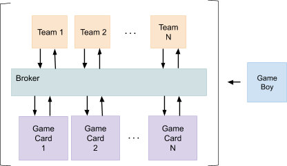
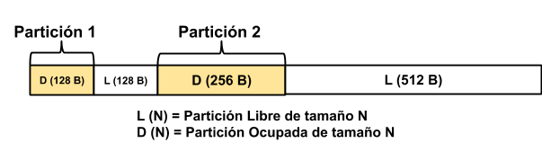
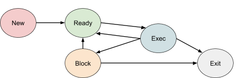
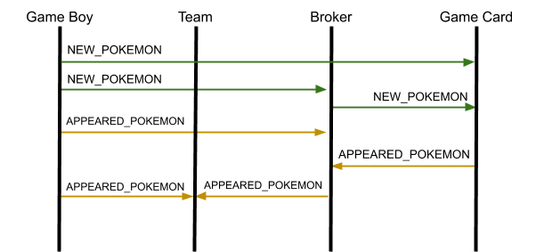
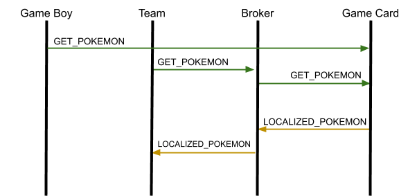
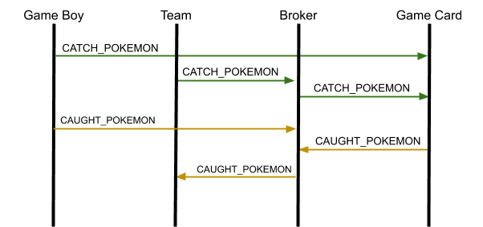

<html>

<head>
    <meta content="text/html; charset=UTF-8" http-equiv="content-type">
</head>

<h1>Sistemas Operativos - Delibird</h1>

<body class="c52 c117">
    

    

    
&Iacute;ndice

    
<a class="c19" href="#h.gjdgxs">Versi&oacute;n de Cambios</a>&nbsp;&nbsp;&nbsp;&nbsp;&nbsp;&nbsp;&nbsp;&nbsp;<a class="c19"
                href="#h.gjdgxs">2</a>

    
<a class="c19" href="#h.6qd0js6b0z7o">Objetivos y Normas de
                resoluci&oacute;n</a>&nbsp;&nbsp;&nbsp;&nbsp;&nbsp;&nbsp;&nbsp;&nbsp;<a class="c19"
                href="#h.6qd0js6b0z7o">6</a>

    
<a class="c19" href="#h.3znysh7">Objetivos del Trabajo
                Pr&aacute;ctico</a>&nbsp;&nbsp;&nbsp;&nbsp;&nbsp;&nbsp;&nbsp;&nbsp;<a class="c19" href="#h.3znysh7">6</a>

    
<a class="c19" href="#h.2et92p0">Caracter&iacute;sticas</a>&nbsp;&nbsp;&nbsp;&nbsp;&nbsp;&nbsp;&nbsp;&nbsp;<a class="c19"
                href="#h.2et92p0">6</a>

    
<a class="c19" href="#h.tyjcwt">Evaluaci&oacute;n del Trabajo
                Pr&aacute;ctico</a>&nbsp;&nbsp;&nbsp;&nbsp;&nbsp;&nbsp;&nbsp;&nbsp;<a class="c19" href="#h.tyjcwt">6</a>

    
<a class="c19" href="#h.3dy6vkm">Deployment y Testing del Trabajo
                Pr&aacute;ctico</a>&nbsp;&nbsp;&nbsp;&nbsp;&nbsp;&nbsp;&nbsp;&nbsp;<a class="c19" href="#h.3dy6vkm">7</a>

    
<a class="c19" href="#h.1t3h5sf">Aclaraciones</a>&nbsp;&nbsp;&nbsp;&nbsp;&nbsp;&nbsp;&nbsp;&nbsp;<a class="c19"
                href="#h.1t3h5sf">7</a>

    
<a class="c19" href="#h.2s8eyo1">Abstract</a>&nbsp;&nbsp;&nbsp;&nbsp;&nbsp;&nbsp;&nbsp;&nbsp;<a class="c19"
                href="#h.2s8eyo1">8</a>

    
<a class="c19" href="#h.17dp8vu">Arquitectura del Sistema</a>&nbsp;&nbsp;&nbsp;&nbsp;&nbsp;&nbsp;&nbsp;&nbsp;<a class="c19"
                href="#h.17dp8vu">9</a>

    
<a class="c19" href="#h.3rdcrjn">Proceso Broker</a>&nbsp;&nbsp;&nbsp;&nbsp;&nbsp;&nbsp;&nbsp;&nbsp;<a class="c19"
                href="#h.3rdcrjn">10</a>

    
<a class="c19" href="#h.26in1rg">Abstract - Message Queue (MQ)</a>&nbsp;&nbsp;&nbsp;&nbsp;&nbsp;&nbsp;&nbsp;&nbsp;<a class="c19"
                href="#h.26in1rg">10</a>

    
<a class="c19" href="#h.lnxbz9">Lineamiento e Implementaci&oacute;n</a>&nbsp;&nbsp;&nbsp;&nbsp;&nbsp;&nbsp;&nbsp;&nbsp;<a class="c19"
                href="#h.lnxbz9">11</a>

    
<a class="c19" href="#h.35nkun2">Administraci&oacute;n de mensajes</a>&nbsp;&nbsp;&nbsp;&nbsp;&nbsp;&nbsp;&nbsp;&nbsp;<a class="c19"
                href="#h.35nkun2">11</a>

    
<a class="c19" href="#h.1ksv4uv">Particiones din&aacute;micas con
                compactaci&oacute;n</a>&nbsp;&nbsp;&nbsp;&nbsp;&nbsp;&nbsp;&nbsp;&nbsp;<a class="c19"
                href="#h.1ksv4uv">12</a>

    
<a class="c19" href="#h.44sinio">Procedimiento para almacenamiento de
                datos</a>&nbsp;&nbsp;&nbsp;&nbsp;&nbsp;&nbsp;&nbsp;&nbsp;<a class="c19" href="#h.44sinio">12</a>

    
<a class="c19" href="#h.2jxsxqh">Algoritmos para elecci&oacute;n de
                partici&oacute;n libre y elecci&oacute;n de v&iacute;ctima</a>&nbsp;&nbsp;&nbsp;&nbsp;&nbsp;&nbsp;&nbsp;&nbsp;<a class="c19"
                href="#h.2jxsxqh">12</a>

    
<a class="c19" href="#h.z337ya">Buddy System</a>&nbsp;&nbsp;&nbsp;&nbsp;&nbsp;&nbsp;&nbsp;&nbsp;<a class="c19"
                href="#h.z337ya">13</a>

    
<a class="c19" href="#h.3j2qqm3">Dump de la Cach&eacute;</a>&nbsp;&nbsp;&nbsp;&nbsp;&nbsp;&nbsp;&nbsp;&nbsp;<a class="c19"
                href="#h.3j2qqm3">13</a>

    
<a class="c19" href="#h.1y810tw">Tipos de Suscribers</a>&nbsp;&nbsp;&nbsp;&nbsp;&nbsp;&nbsp;&nbsp;&nbsp;<a class="c19"
                href="#h.1y810tw">14</a>

    
<a class="c19" href="#h.4i7ojhp">Suscriptor global</a>&nbsp;&nbsp;&nbsp;&nbsp;&nbsp;&nbsp;&nbsp;&nbsp;<a class="c19"
                href="#h.4i7ojhp">14</a>

    
<a class="c19" href="#h.2xcytpi">Suscriptor globales por mensajes
                correlativos</a>&nbsp;&nbsp;&nbsp;&nbsp;&nbsp;&nbsp;&nbsp;&nbsp;<a class="c19" href="#h.2xcytpi">14</a>

    
<a class="c19" href="#h.1ci93xb">Listado de Message Queues</a>&nbsp;&nbsp;&nbsp;&nbsp;&nbsp;&nbsp;&nbsp;&nbsp;<a class="c19"
                href="#h.1ci93xb">15</a>

    
<a class="c19" href="#h.3whwml4">Tipos de datos</a>&nbsp;&nbsp;&nbsp;&nbsp;&nbsp;&nbsp;&nbsp;&nbsp;<a class="c19"
                href="#h.3whwml4">15</a>

    
<a class="c19" href="#h.2bn6wsx">Logs obligatorios</a>&nbsp;&nbsp;&nbsp;&nbsp;&nbsp;&nbsp;&nbsp;&nbsp;<a class="c19"
                href="#h.2bn6wsx">15</a>

    
<a class="c19" href="#h.qsh70q">Archivo de Configuraci&oacute;n</a>&nbsp;&nbsp;&nbsp;&nbsp;&nbsp;&nbsp;&nbsp;&nbsp;<a class="c19"
                href="#h.qsh70q">16</a>

    
<a class="c19" href="#h.3as4poj">Ejemplo de Archivo de
                Configuraci&oacute;n</a>&nbsp;&nbsp;&nbsp;&nbsp;&nbsp;&nbsp;&nbsp;&nbsp;<a class="c19"
                href="#h.3as4poj">16</a>

    
<a class="c19" href="#h.1pxezwc">Proceso Game Card</a>&nbsp;&nbsp;&nbsp;&nbsp;&nbsp;&nbsp;&nbsp;&nbsp;<a class="c19"
                href="#h.1pxezwc">17</a>

    
<a class="c19" href="#h.49x2ik5">Tall Grass</a>&nbsp;&nbsp;&nbsp;&nbsp;&nbsp;&nbsp;&nbsp;&nbsp;<a class="c19"
                href="#h.49x2ik5">17</a>

    
<a class="c19" href="#h.2p2csry">Metadata</a>&nbsp;&nbsp;&nbsp;&nbsp;&nbsp;&nbsp;&nbsp;&nbsp;<a class="c19"
                href="#h.2p2csry">17</a>

    
<a class="c19" href="#h.147n2zr">Bitmap</a>&nbsp;&nbsp;&nbsp;&nbsp;&nbsp;&nbsp;&nbsp;&nbsp;<a class="c19"
                href="#h.147n2zr">18</a>

    
<a class="c19" href="#h.3o7alnk">Files Metadata</a>&nbsp;&nbsp;&nbsp;&nbsp;&nbsp;&nbsp;&nbsp;&nbsp;<a class="c19"
                href="#h.3o7alnk">18</a>

    
<a class="c19" href="#h.23ckvvd">Datos</a>&nbsp;&nbsp;&nbsp;&nbsp;&nbsp;&nbsp;&nbsp;&nbsp;<a class="c19"
                href="#h.23ckvvd">18</a>

    
<a class="c19" href="#h.ihv636">Lineamiento e Implementaci&oacute;n</a>&nbsp;&nbsp;&nbsp;&nbsp;&nbsp;&nbsp;&nbsp;&nbsp;<a class="c19"
                href="#h.ihv636">19</a>

    
<a class="c19" href="#h.32hioqz">Archivos Pokemon</a>&nbsp;&nbsp;&nbsp;&nbsp;&nbsp;&nbsp;&nbsp;&nbsp;<a class="c19"
                href="#h.32hioqz">19</a>

    
<a class="c19" href="#h.1hmsyys">New Pokemon</a>&nbsp;&nbsp;&nbsp;&nbsp;&nbsp;&nbsp;&nbsp;&nbsp;<a class="c19"
                href="#h.1hmsyys">20</a>

    
<a class="c19" href="#h.41mghml">Catch Pokemon</a>&nbsp;&nbsp;&nbsp;&nbsp;&nbsp;&nbsp;&nbsp;&nbsp;<a class="c19"
                href="#h.41mghml">20</a>

    
<a class="c19" href="#h.2grqrue">Get Pokemon</a>&nbsp;&nbsp;&nbsp;&nbsp;&nbsp;&nbsp;&nbsp;&nbsp;<a class="c19"
                href="#h.2grqrue">21</a>

    
<a class="c19" href="#h.vx1227">Archivo de Configuraci&oacute;n</a>&nbsp;&nbsp;&nbsp;&nbsp;&nbsp;&nbsp;&nbsp;&nbsp;<a class="c19"
                href="#h.vx1227">22</a>

    
<a class="c19" href="#h.3fwokq0">Ejemplo de Archivo de
                Configuraci&oacute;n</a>&nbsp;&nbsp;&nbsp;&nbsp;&nbsp;&nbsp;&nbsp;&nbsp;<a class="c19"
                href="#h.3fwokq0">22</a>

    
<a class="c19" href="#h.1v1yuxt">Proceso Team</a>&nbsp;&nbsp;&nbsp;&nbsp;&nbsp;&nbsp;&nbsp;&nbsp;<a class="c19"
                href="#h.1v1yuxt">23</a>

    
<a class="c19" href="#h.4f1mdlm">Lineamiento e Implementaci&oacute;n</a>&nbsp;&nbsp;&nbsp;&nbsp;&nbsp;&nbsp;&nbsp;&nbsp;<a class="c19"
                href="#h.4f1mdlm">23</a>

    
<a class="c19" href="#h.2u6wntf">Planificaci&oacute;n</a>&nbsp;&nbsp;&nbsp;&nbsp;&nbsp;&nbsp;&nbsp;&nbsp;<a class="c19"
                href="#h.2u6wntf">23</a>

    
<a class="c19" href="#h.19c6y18">Diagrama de estados de un Entrenador</a>&nbsp;&nbsp;&nbsp;&nbsp;&nbsp;&nbsp;&nbsp;&nbsp;<a class="c19"
                href="#h.19c6y18">24</a>

    
<a class="c19" href="#h.3tbugp1">Competici&oacute;n y Deadlock</a>&nbsp;&nbsp;&nbsp;&nbsp;&nbsp;&nbsp;&nbsp;&nbsp;<a class="c19"
                href="#h.3tbugp1">25</a>

    
<a class="c19" href="#h.28h4qwu">Tipo de mensajes</a>&nbsp;&nbsp;&nbsp;&nbsp;&nbsp;&nbsp;&nbsp;&nbsp;<a class="c19"
                href="#h.28h4qwu">25</a>

    
<a class="c19" href="#h.nmf14n">Appeared Pokemon</a>&nbsp;&nbsp;&nbsp;&nbsp;&nbsp;&nbsp;&nbsp;&nbsp;<a class="c19"
                href="#h.nmf14n">25</a>

    
<a class="c19" href="#h.37m2jsg">Get Pokemon</a>&nbsp;&nbsp;&nbsp;&nbsp;&nbsp;&nbsp;&nbsp;&nbsp;<a class="c19"
                href="#h.37m2jsg">26</a>

    
<a class="c19" href="#h.1mrcu09">Catch Pokemon</a>&nbsp;&nbsp;&nbsp;&nbsp;&nbsp;&nbsp;&nbsp;&nbsp;<a class="c19"
                href="#h.1mrcu09">26</a>

    
<a class="c19" href="#h.46r0co2">Localized Pok&eacute;mon</a>&nbsp;&nbsp;&nbsp;&nbsp;&nbsp;&nbsp;&nbsp;&nbsp;<a class="c19"
                href="#h.46r0co2">26</a>

    
<a class="c19" href="#h.2lwamvv">Caught Pok&eacute;mon</a>&nbsp;&nbsp;&nbsp;&nbsp;&nbsp;&nbsp;&nbsp;&nbsp;<a class="c19"
                href="#h.2lwamvv">27</a>

    
<a class="c19" href="#h.111kx3o">Logs obligatorios</a>&nbsp;&nbsp;&nbsp;&nbsp;&nbsp;&nbsp;&nbsp;&nbsp;<a class="c19"
                href="#h.111kx3o">27</a>

    
<a class="c19" href="#h.3l18frh">Archivo de Configuraci&oacute;n</a>&nbsp;&nbsp;&nbsp;&nbsp;&nbsp;&nbsp;&nbsp;&nbsp;<a class="c19"
                href="#h.3l18frh">28</a>

    
<a class="c19" href="#h.206ipza">Ejemplo de Archivo de
                Configuraci&oacute;n</a>&nbsp;&nbsp;&nbsp;&nbsp;&nbsp;&nbsp;&nbsp;&nbsp;<a class="c19"
                href="#h.206ipza">28</a>

    
<a class="c19" href="#h.4k668n3">Proceso Game Boy</a>&nbsp;&nbsp;&nbsp;&nbsp;&nbsp;&nbsp;&nbsp;&nbsp;<a class="c19"
                href="#h.4k668n3">30</a>

    
<a class="c19" href="#h.2zbgiuw">Lineamiento e Implementaci&oacute;n</a>&nbsp;&nbsp;&nbsp;&nbsp;&nbsp;&nbsp;&nbsp;&nbsp;<a class="c19"
                href="#h.2zbgiuw">30</a>

    
<a class="c19" href="#h.1egqt2p">Broker - New Pokemon</a>&nbsp;&nbsp;&nbsp;&nbsp;&nbsp;&nbsp;&nbsp;&nbsp;<a class="c19"
                href="#h.1egqt2p">30</a>

    
<a class="c19" href="#h.3ygebqi">Broker - Appeared Pokemon</a>&nbsp;&nbsp;&nbsp;&nbsp;&nbsp;&nbsp;&nbsp;&nbsp;<a class="c19"
                href="#h.3ygebqi">30</a>

    
<a class="c19" href="#h.2dlolyb">Broker - Catch Pokemon</a>&nbsp;&nbsp;&nbsp;&nbsp;&nbsp;&nbsp;&nbsp;&nbsp;<a class="c19"
                href="#h.2dlolyb">31</a>

    
<a class="c19" href="#h.sqyw64">Broker - Caught Pokemon</a>&nbsp;&nbsp;&nbsp;&nbsp;&nbsp;&nbsp;&nbsp;&nbsp;<a class="c19"
                href="#h.sqyw64">31</a>

    
<a class="c19" href="#h.3cqmetx">Broker - Get Pokemon</a>&nbsp;&nbsp;&nbsp;&nbsp;&nbsp;&nbsp;&nbsp;&nbsp;<a class="c19"
                href="#h.3cqmetx">31</a>

    
<a class="c19" href="#h.1rvwp1q">Team - Appeared Pokemon</a>&nbsp;&nbsp;&nbsp;&nbsp;&nbsp;&nbsp;&nbsp;&nbsp;<a class="c19"
                href="#h.1rvwp1q">31</a>

    
<a class="c19" href="#h.4bvk7pj">Game Card - New Pokemon</a>&nbsp;&nbsp;&nbsp;&nbsp;&nbsp;&nbsp;&nbsp;&nbsp;<a class="c19"
                href="#h.4bvk7pj">31</a>

    
<a class="c19" href="#h.2r0uhxc">Game Card - Catch Pokemon</a>&nbsp;&nbsp;&nbsp;&nbsp;&nbsp;&nbsp;&nbsp;&nbsp;<a class="c19"
                href="#h.2r0uhxc">31</a>

    
<a class="c19" href="#h.1664s55">Game Card - Get Pokemon</a>&nbsp;&nbsp;&nbsp;&nbsp;&nbsp;&nbsp;&nbsp;&nbsp;<a class="c19"
                href="#h.1664s55">31</a>

    
<a class="c19" href="#h.3q5sasy">Modo Suscriptor</a>&nbsp;&nbsp;&nbsp;&nbsp;&nbsp;&nbsp;&nbsp;&nbsp;<a class="c19"
                href="#h.3q5sasy">31</a>

    
<a class="c19" href="#h.25b2l0r">Logs obligatorios</a>&nbsp;&nbsp;&nbsp;&nbsp;&nbsp;&nbsp;&nbsp;&nbsp;<a class="c19"
                href="#h.25b2l0r">32</a>

    
<a class="c19" href="#h.kgcv8k">Archivo de Configuraci&oacute;n</a>&nbsp;&nbsp;&nbsp;&nbsp;&nbsp;&nbsp;&nbsp;&nbsp;<a class="c19"
                href="#h.kgcv8k">32</a>

    
<a class="c19" href="#h.34g0dwd">Ejemplo de Archivo de
                Configuraci&oacute;n</a>&nbsp;&nbsp;&nbsp;&nbsp;&nbsp;&nbsp;&nbsp;&nbsp;<a class="c19"
                href="#h.34g0dwd">32</a>

    
<a class="c19" href="#h.1jlao46">Anexo I - Ejemplos de Flujos</a>&nbsp;&nbsp;&nbsp;&nbsp;&nbsp;&nbsp;&nbsp;&nbsp;<a class="c19"
                href="#h.1jlao46">33</a>

    
<a class="c19" href="#h.43ky6rz">Flujo New Pokemon - Appeared Pokemon</a>&nbsp;&nbsp;&nbsp;&nbsp;&nbsp;&nbsp;&nbsp;&nbsp;<a class="c19"
                href="#h.43ky6rz">33</a>

    
<a class="c19" href="#h.2iq8gzs">Flujo Get Pokemon - Localized
                Pokemon</a>&nbsp;&nbsp;&nbsp;&nbsp;&nbsp;&nbsp;&nbsp;&nbsp;<a class="c19" href="#h.2iq8gzs">33</a>

    
<a class="c19" href="#h.xvir7l">Flujo Catch Pokemon - Caught Pokemon</a>&nbsp;&nbsp;&nbsp;&nbsp;&nbsp;&nbsp;&nbsp;&nbsp;<a class="c19"
                href="#h.xvir7l">34</a>

    
<a class="c19" href="#h.3hv69ve">Anexo II - Mensajes en memoria</a>&nbsp;&nbsp;&nbsp;&nbsp;&nbsp;&nbsp;&nbsp;&nbsp;<a class="c19"
                href="#h.3hv69ve">35</a>

    
<a class="c19" href="#h.1x0gk37">Tama&ntilde;o de New Pokemon</a>&nbsp;&nbsp;&nbsp;&nbsp;&nbsp;&nbsp;&nbsp;&nbsp;<a class="c19"
                href="#h.1x0gk37">35</a>

    
<a class="c19" href="#h.4h042r0">Tama&ntilde;o de Get Pokemon</a>&nbsp;&nbsp;&nbsp;&nbsp;&nbsp;&nbsp;&nbsp;&nbsp;<a class="c19"
                href="#h.4h042r0">35</a>

    
<a class="c19" href="#h.2w5ecyt">Tama&ntilde;o de Appeared Pokemon</a>&nbsp;&nbsp;&nbsp;&nbsp;&nbsp;&nbsp;&nbsp;&nbsp;<a class="c19"
                href="#h.2w5ecyt">35</a>

    
<a class="c19" href="#h.1baon6m">Tama&ntilde;o de Catch Pokemon</a>&nbsp;&nbsp;&nbsp;&nbsp;&nbsp;&nbsp;&nbsp;&nbsp;<a class="c19"
                href="#h.1baon6m">36</a>

    
<a class="c19" href="#h.3vac5uf">Tama&ntilde;o de Caught Pokemon</a>&nbsp;&nbsp;&nbsp;&nbsp;&nbsp;&nbsp;&nbsp;&nbsp;<a class="c19"
                href="#h.3vac5uf">36</a>

    
<a class="c19" href="#h.pkwqa1">Descripci&oacute;n de las
                entregas</a>&nbsp;&nbsp;&nbsp;&nbsp;&nbsp;&nbsp;&nbsp;&nbsp;<a class="c19" href="#h.pkwqa1">37</a>

    
<a class="c19" href="#h.9vyywhatg0r2">Hito 1: Conexi&oacute;n
                Inicial</a>&nbsp;&nbsp;&nbsp;&nbsp;&nbsp;&nbsp;&nbsp;&nbsp;<a class="c19" href="#h.9vyywhatg0r2">37</a>

    
<a class="c19" href="#h.1opuj5n">Hito 2: Avance del Grupo</a>&nbsp;&nbsp;&nbsp;&nbsp;&nbsp;&nbsp;&nbsp;&nbsp;<a class="c19"
                href="#h.1opuj5n">37</a>

    
<a class="c19" href="#h.1302m92">Hito 3: Checkpoint &ldquo;Presencial&rdquo; -
                V&iacute;a pantalla compartida</a>&nbsp;&nbsp;&nbsp;&nbsp;&nbsp;&nbsp;&nbsp;&nbsp;<a class="c19"
                href="#h.1302m92">38</a>

    
<a class="c19" href="#h.2250f4o">Hito 4: Avance del Grupo</a>&nbsp;&nbsp;&nbsp;&nbsp;&nbsp;&nbsp;&nbsp;&nbsp;<a class="c19"
                href="#h.2250f4o">38</a>

    
<a class="c19" href="#h.haapch">Hito 5: Entregas Finales</a>&nbsp;&nbsp;&nbsp;&nbsp;&nbsp;&nbsp;&nbsp;&nbsp;<a class="c19"
                href="#h.haapch">38</a>

    <h1 class="c20 c17" id="h.6qd0js6b0z7o">Objetivos y Normas de resoluci&oacute;n
    </h1>
    <h2 class="c16" id="h.3znysh7">Objetivos del Trabajo Pr&aacute;ctico</h2>
    
Mediante la realizaci&oacute;n de este trabajo se espera que el alumno:

    <ul class="c32 lst-kix_list_2-0 start">
        <li class="c23">Adquiera conceptos pr&aacute;cticos del uso de las distintas herramientas de
                programaci&oacute;n e interfaces (APIs) que brindan los sistemas operativos.</li>
        <li class="c23">Entienda aspectos del dise&ntilde;o de un sistema operativo.</li>
        <li class="c23">Afirme diversos conceptos te&oacute;ricos de la materia mediante la
                implementaci&oacute;n pr&aacute;ctica de algunos de ellos.</li>
        <li class="c23">Se familiarice con t&eacute;cnicas de programaci&oacute;n de sistemas, como el
                empleo de makefiles, archivos de configuraci&oacute;n y archivos de log.</li>
        <li class="c69 c47">Conozca con grado de detalle la operatoria de Linux mediante la
                utilizaci&oacute;n de un lenguaje de programaci&oacute;n de relativamente bajo nivel como C.</li>
    </ul>
    <h2 class="c16" id="h.2et92p0">Caracter&iacute;sticas</h2>
    <ul class="c32 lst-kix_list_19-0 start">
        <li class="c23">Modalidad: grupal (5 integrantes +- 0) y obligatorio</li>
        <li class="c23">Tiempo estimado para su desarrollo: 90 d&iacute;as</li>
        <li class="c23">Fecha de comienzo: &nbsp;03 de Abril</li>
        <li class="c23">Fecha de primera entrega: 25 de Julio (fecha tentativa a la
                espera de actualizaci&oacute;n de calendario acad&eacute;mico)</li>
        <li class="c23">Fecha de segunda entrega: 1 de Agosto (fecha tentativa a la
                espera de actualizaci&oacute;n de calendario acad&eacute;mico)</li>
        <li class="c23">Fecha de tercera entrega: 22 de Agosto (fecha tentativa a la
                espera de actualizaci&oacute;n de calendario acad&eacute;mico)</li>
        <li class="c69 c47">Lugar de correcci&oacute;n: Laboratorio de Medrano</li>
    </ul>
    <h2 class="c16" id="h.tyjcwt">Evaluaci&oacute;n del Trabajo Pr&aacute;ctico</h2>
    
El trabajo pr&aacute;ctico consta de una evaluaci&oacute;n en 2 etapas. 

    
La primera etapa consistir&aacute; en las pruebas de los programas desarrollados en el
            laboratorio. Las pruebas del trabajo pr&aacute;ctico se subir&aacute;n oportunamente y con suficiente tiempo
            para que los alumnos puedan evaluarlas con antelaci&oacute;n. Queda aclarado que para que un trabajo
            pr&aacute;ctico sea considerado evaluable, el mismo debe
            proporcionar registros de su &nbsp;funcionamiento de la forma m&aacute;s clara posible.

    
La segunda etapa se dar&aacute; en caso de aprobada&nbsp;la primera y constar&aacute; de un coloquio, con el objetivo de
            afianzar los conocimientos adquiridos durante el desarrollo del trabajo pr&aacute;ctico y terminar de
            definir la nota de cada uno de los integrantes del grupo, por lo que se recomienda&nbsp;que la carga de trabajo se distribuya de la manera
            m&aacute;s equitativa posible.

    
Cabe aclarar que el trabajo equitativo no asegura la aprobaci&oacute;n de la
            totalidad de los integrantes, sino que cada uno tendr&aacute; que defender y explicar tanto te&oacute;rica
            como pr&aacute;cticamente lo desarrollado y aprendido a lo largo de la cursada.

    
La defensa del trabajo pr&aacute;ctico (o coloquio) consta de la relaci&oacute;n de lo visto
            durante la teor&iacute;a con lo implementado. De esta manera, una implementaci&oacute;n que
            contradiga a lo visto en clase o lo escrito en el documento es motivo de
            desaprobaci&oacute;n del trabajo pr&aacute;ctico.

    <h2 class="c16" id="h.3dy6vkm">Deployment y Testing del Trabajo Pr&aacute;ctico</h2>
    
Al tratarse de una plataforma distribuida, los procesos involucrados podr&aacute;n ser
            ejecutados en diversas computadoras. La cantidad de computadoras involucradas y la distribuci&oacute;n de
            los diversos procesos en estas ser&aacute; definida en cada uno de los tests de la evaluaci&oacute;n y
        es posible cambiar la misma en el momento de la evaluaci&oacute;n. Es responsabilidad del grupo automatizar el despliegue de los diversos procesos con sus
            correspondientes archivos de configuraci&oacute;n para cada uno de los diversos tests a evaluar.

    
Todo esto estar&aacute; detallado en el documento de pruebas que se publicar&aacute;
            cercano a la fecha de Entrega Final. Archivos y programas de ejemplo se pueden encontrar en el repositorio
            de la c&aacute;tedra. 

    
Finalmente, recordar la existencia de las <a
                class="c19"
                href="https://www.google.com/url?q=https://faq.utnso.com.ar/ntp&amp;sa=D&amp;ust=1595200539629000&amp;usg=AOvVaw2i9Bt6InYzuCoQZXen-4Wq">Normas
                del Trabajo Pr&aacute;ctico</a>&nbsp;donde se especifican todos los
            lineamientos de c&oacute;mo se desarrollar&aacute; la materia durante el cuatrimestre.

    

    <h2 class="c16" id="h.1t3h5sf">Aclaraciones</h2>
    
Debido al fin acad&eacute;mico del trabajo pr&aacute;ctico, los conceptos reflejados son, en
            general, versiones simplificadas o alteradas&nbsp;de los
            componentes reales de hardware y de sistemas operativos modernos, a fin de resaltar aspectos de
            dise&ntilde;o.

    
Invitamos a los alumnos a leer las notas y comentarios al respecto que haya en el
            enunciado, reflexionar y discutir con sus compa&ntilde;eros, ayudantes y docentes al respecto.

    <h1 class="c20 c17 c96" id="h.4d34og8"></h1>
    

    

    <h1 class="c20 c17" id="h.2s8eyo1">Abstract</h1>
    
El objetivo del trabajo pr&aacute;ctico consiste en desarrollar una soluci&oacute;n
            que permita la simulaci&oacute;n de un sistema distribuido que utiliza el concepto de Colas de Mensajes (o
            Message Queue).

    
Los componentes incluidos dentro de la arquitectura del sistema deber&aacute;n
            trabajar en conjunto para la planificaci&oacute;n y ejecuci&oacute;n de distintas operaciones, entre las que
            se encuentran, por ejemplo: leer y escribir valores. Las operaciones que conforman estos mensajes
            est&aacute;n asociadas y vinculadas al mundo de Pok&eacute;mon.

    
Message Queue (a partir de ahora MQ) es una t&eacute;cnica de software utilizada para la
            comunicaci&oacute;n entre procesos (IPC) basada en el concepto de Colas (Queue). En ella, distintos procesos
            dejan mensajes y otros los leen de manera asincr&oacute;nica. De esta manera, se permite el desarrollo de un
            sistema completamente distribuido, escalable e independiente.

    
Los componentes del sistema ser&aacute;n:

    <ul class="c32 lst-kix_list_7-0 start">
        <li class="c25 c17">Un proceso publisher que ingrese mensajes al sistema (Game Boy).</li>
        <li class="c25 c17">Un proceso administrador de las Colas de Mensajes (Broker).</li>
        <li class="c25 c17">Procesos que obtengan los mensajes y planifiquen en funci&oacute;n de ellos
                (Team).</li>
        <li class="c2 c47">Procesos filesystem que se encarguen de mantener los archivos en el tiempo (Game
                Card).</li>
    </ul>
    

    

    

    <h1 class="c20 c17" id="h.17dp8vu">Arquitectura del Sistema </h1>
    
Como dijimos anteriormente el sistema consta de 4 m&oacute;dulos independientes los
            cuales interact&uacute;an entre s&iacute; como se muestra en el siguiente diagrama.

    

    

    
El Game Boy ser&aacute; nuestro punto de partida y asimismo, que conocer&aacute; y
            permitir&aacute; el env&iacute;o de mensajes a distintos m&oacute;dulos de nuestro sistema.

    
El proceso Broker ser&aacute; el encargado de administrar las distintas Colas de
            Mensajes existentes en el sistema. Para esto, el mismo mantendr&aacute; distintas caracter&iacute;sticas y
            funcionalidades propias de un sistema de Cola de Mensajes real, encarg&aacute;ndose de mantener, entender y
            distribuir los distintos mensajes.

    
El proceso Team contendr&aacute; una lista de entrenadores con distintos objetivos de captura
            de Pokemons. Nuestro proceso deber&aacute; planificar a los entrenadores correctamente para que
            cumplan sus objetivos cooperativamente dentro de un mapa. De esta manera, los
            Pokemon seran recursos que los distintos entrenadores deber&aacute;n atrapar movi&eacute;ndose por el mapa
            (apropiarse) y luego intercambiar en caso de ser necesario (se produzca un deadlock).

    
Por &uacute;ltimo, nuestro proceso Game Card ser&aacute; el encargado de conocer qu&eacute;
            Pokemon se encuentran disponibles dentro del mapa y en qu&eacute; posici&oacute;n est&aacute; cada uno.
            Deber&aacute; mantener distintos permisos y atribuciones para que solo un proceso pueda acceder al mismo
            tiempo a &eacute;l. Al estar este proceso conectado al Broker y asociarse a una cola de mensajes
            espec&iacute;fica nos permite generar redundancia de Game Card y poder replicar con distintas demoras o
            distintos file system los mismos archivos.
        

    

    <h1 class="c20 c17" id="h.3rdcrjn">Proceso Broker</h1>
    
Ser&aacute; el encargado de administrar las colas de mensajes de nuestro sistema.
            Como tal tendr&aacute; la responsabilidad de:

    <ol class="c32 lst-kix_list_14-0 start" start="1">
        <li class="c25 c17">Administrar los suscriptores (Teams, Game Cards) asociados a las distintas
                colas.</li>
        <li class="c25 c17">Administrar la recepci&oacute;n, env&iacute;o y confirmaci&oacute;n de todos los
                mensajes a los m&uacute;ltiples suscriptores.</li>
        <li class="c25 c17">Mantener un registro de los &uacute;ltimos mensajes recibidos de las colas indicadas
                para futuros suscriptores.</li>
        <li class="c2 c47">Mantener e informar en todo momento los estados de las colas, con sus mensajes y
                suscriptores.</li>
    </ol>
    
Para explicar esto, primero nos enfocaremos en el conceptos t&eacute;cnicos de
            qu&eacute; es una Cola de mensajes (o Message Queue) para luego abordar los aspectos y lineamientos
            t&eacute;cnicos que tendr&aacute; nuestra implementaci&oacute;n. 

    <h2 class="c16" id="h.26in1rg">Abstract - Message Queue (MQ)</h2>
    
Las colas de mensajes son software que permiten la comunicaci&oacute;n entre procesos
            (IPC) de manera as&iacute;ncrona, lo que significa que el emisor y el receptor del mensaje no necesitan
            interactuar con la cola de mensajes al mismo tiempo. 

    
Cada mensaje colocado en una cola se almacena hasta que el/los destinatarios los
            recuperen y/o lean. Las colas de mensajes tienen l&iacute;mites impl&iacute;citos o expl&iacute;citos sobre
            el tama&ntilde;o de los datos que pueden ser transmitidos en un solo mensaje y el n&uacute;mero de mensajes
            que pueden quedar pendientes en la cola.

    
De esta manera, vamos a tener varios procesos que van a funcionar como publicadores (o
            Publishers) que van a ser los encargados de dejar mensajes en una Cola de mensajes en particular mientras
            que otros procesos van a funcionar como suscriptores (o Suscribers) que
            van a recibir aquellos mensajes que lleguen a las colas de mensajes donde est&eacute;n suscriptos.
    

    

    
En el &aacute;mbito de nuestro trabajo practico implementaremos una serie de colas de
            mensajes que utilizaremos para distintos prop&oacute;sitos que explicaremos m&aacute;s adelante. Dichas
            colas de mensajes deben cumplir con los siguientes aspectos t&eacute;cnicos:

    <ol class="c32 lst-kix_list_9-0 start" start="1">
        <li class="c17 c25">Durabilidad: Todo mensaje debe permanecer en la cola de mensajes hasta que todos los
            Suscribers&nbsp;lo reciban.</li>
        <li class="c25 c17">Notificaci&oacute;n de recepci&oacute;n: Todo mensaje entregado debe ser confirmado
                por cada Suscriptor para marcarlo y no enviarse nuevamente al mismo.</li>
        <li class="c25 c17">Mantenibilidad: Cada cola de mensaje debe mantener su estado y borrar los mensajes que
                fueron eliminados de la cach&eacute; por el algoritmo de reemplazo</li>
        <li class="c2 c47">Asincronismo: La recepci&oacute;n y notificaci&oacute;n de mensajes pueden diferir en
                el tiempo. No deben notificarse inmediatamente a los componentes suscritos a dicha cola.</li>
    </ol>
    <h2 class="c16" id="h.lnxbz9">Lineamiento e Implementaci&oacute;n</h2>
    
El Broker se encarga, como dijimos anteriormente, de la administraci&oacute;n de MQ
            de nuestro sistema, simulando algunos aspectos t&eacute;cnicos de sus implementaciones en la realidad. Por
            otra parte, se incorporan conceptos de la materia como administraci&oacute;n de memoria, mensajer&iacute;a y
            sincronizaci&oacute;n. 

    
La funcionalidad principal del Broker es la de administrar las distintas colas de
            mensajes con sus distintos suscriptores. Para esto, esperar&aacute; las solicitudes de los distintos
            m&oacute;dulos para asociarse a las distintas colas que &eacute;l mismo administra. De esta manera, cada uno
            de los clientes/m&oacute;dulos se deber&aacute; comunicar con &eacute;l indicando cual es la cola a la que
            se desea suscribir (en este punto llamaremos al otro m&oacute;dulo como suscriptor). 

    
Una vez informado esto, el Broker dispondr&aacute; de una lista de suscriptores por
            cada cola que el mismo administre. En otra instancia de tiempo, un mensaje llegar&aacute; con el destino a
            dicha cola de mensajes y el Broker distribuir&aacute; dicho mensaje a los suscriptores (enviar&aacute; dicho
            mensaje a cada uno de los suscriptores). Al realizar esto se deber&aacute; tener en cuenta lo
            siguiente:

    <ol class="c32 lst-kix_list_33-0 start" start="1">
        <li class="c25 c17">Todo mensaje debe ser cacheado dentro de la memoria interna del Broker.</li>
        <li class="c25 c17">Todo mensaje debe saber a cuales suscriptores fue enviado y si el mismo fue recibido
                (confirmaci&oacute;n, ACK &oacute; acknowledgement).</li>
        <li class="c2 c47">Todo mensaje debe tener un identificador un&iacute;voco generado por el Broker que debe
                ser informado al m&oacute;dulo que gener&oacute; el mismo.</li>
    </ol>
    
Esta funcionalidad deber&aacute; ser implementada por medio de
            multi-hilos. Esta arquitectura permitir&aacute; al Broker poder enviar y transaccionar mensajes
            en simult&aacute;neo a los distintos suscriptores. Cualquier otra
            implementaci&oacute;n que no est&eacute; bajo este concepto ser&aacute; motivo de desaprobaci&oacute;n del
            trabajo pr&aacute;ctico. 

    <h3 class="c38 c17" id="h.35nkun2">Administraci&oacute;n de mensajes</h3>
    
Como dijimos anteriormente, el Broker mantendr&aacute; una memoria interna en la cual se cachean
            los &uacute;ltimos mensajes recibidos de las distintas colas de mensajes. En el mismo
            deber&aacute; registrar:

    <ol class="c32 lst-kix_list_35-0 start" start="1">
        <li class="c25 c17">Identificador &uacute;nico del mensaje dentro del sistema.</li>
        <li class="c25 c17">El tipo de mensaje (a que cola de mensajes pertenece).</li>
        <li class="c25 c17">Los suscriptores a los cuales ya se envi&oacute; el mensaje.</li>
        <li class="c2 c47">Los suscriptores que retornaron el ACK del mismo.</li>
    </ol>
    
Se implementar&aacute;n dos esquemas de Administraci&oacute;n de Memoria: Particiones
            din&aacute;micas con compactaci&oacute;n, y Buddy System (descritos m&aacute;s adelante). Se elegir&aacute;
            por archivo de configuraci&oacute;n cual estar&aacute; activa al iniciar la cach&eacute;. Para ambos, se
            definir&aacute; por par&aacute;metro del Broker el tama&ntilde;o m&iacute;nimo de partici&oacute;n y un
            tama&ntilde;o m&aacute;ximo (que ser&aacute; el de toda la memoria).

    
Uno de los requerimientos obligatorios que va a tener el Broker es que una vez inicializado ya
            no se podr&aacute; reservar m&aacute;s memoria din&aacute;mica para guardar los datos. Por lo tanto,
        toda la memoria que vaya a ser necesaria&nbsp;para el
            almacenamiento de los datos deber&aacute; ser pre-reservadas din&aacute;micamente en el inicio. Solo se
            deber&aacute; guardar en la porci&oacute;n de datos el contenido del mensaje dejando el tipo, identificador
            y dem&aacute;s flags del mismo en estructuras auxiliares.

    
Cada vez que un proceso se suscriba a una cola de mensajes deber&aacute; recibir todos los mensajes cacheados de dicha cola de mensajes.

    <h3 class="c38 c17" id="h.1ksv4uv">Particiones din&aacute;micas con compactaci&oacute;n<a href="#ftnt1" id="ftnt_ref1">[1]</a></h3>
    
En este esquema, se reservar&aacute; una porci&oacute;n de memoria por cada valor
            almacenado, del tama&ntilde;o exacto de dicho valor. De esta manera, la cantidad de particiones y su
            tama&ntilde;o es variable. Por ejemplo:

    

    
En dicho ejemplo, en el caso de almacenar un nuevo valor de 0,2 Kb en el espacio de
            la primera &nbsp;partici&oacute;n libre, se tendr&iacute;a una nueva &ldquo;partici&oacute;n 4&rdquo; de 0,2
            Kb, y al lado una nueva partici&oacute;n libre de 0,3 Kb.

    <h4 class="c11" id="h.44sinio">Procedimiento para almacenamiento de datos</h4>
    <ol class="c32 lst-kix_list_29-0 start" start="1">
        <li class="c25 c17">Se buscar&aacute; una partici&oacute;n libre que tenga suficiente memoria continua
                como para contener el valor. En caso de no encontrarla, se pasar&aacute; al paso siguiente (si
                corresponde<a href="#ftnt2" id="ftnt_ref2">[2]</a>, en caso
                contrario se pasar&aacute; al paso 3 directamente).</li>
        <li class="c25 c17">Se compactar&aacute; la memoria y se realizar&aacute; una nueva b&uacute;squeda. En
                caso de no encontrarla, se pasar&aacute; al paso siguiente.</li>
        <li class="c2 c47">Se proceder&aacute; a eliminar una partici&oacute;n de datos. Luego, si no
                se pudo encontrar una partici&oacute;n con suficiente memoria como para contener el
                valor,&nbsp;se volver&aacute; al paso 2 o al 3 seg&uacute;n corresponda.</li>
    </ol>
    <h4 class="c11" id="h.2jxsxqh">Algoritmos para elecci&oacute;n de partici&oacute;n libre y
            elecci&oacute;n de v&iacute;ctima</h4>
    
Para seleccionar una partici&oacute;n libre, se deber&aacute; implementar los
            siguientes pares de algoritmos: 

    <ul class="c32 lst-kix_list_40-0 start">
        <li class="c2 c47">First Fit (primer ajuste) y Best Fit (mejor ajuste).</li>
    </ul>
    
En el caso de tener que eliminar una partici&oacute;n, los algoritmos a implementar
            ser&aacute;n:

    <ul class="c32 lst-kix_list_15-0 start">
        <li class="c2 c47">FIFO (First In First Out) y LRU (Least Recently Used).</li>
    </ul>
    
En ambos casos, el algoritmo a utilizar se definir&aacute; por archivo de
            configuraci&oacute;n.

    <h3 class="c38 c17" id="h.z337ya">Buddy System<a href="#ftnt3"
                id="ftnt_ref3">[3]</a></h3>
    
En este esquema, se reservar&aacute; una partici&oacute;n de memoria por cada valor
            almacenado, del tama&ntilde;o potencia de 2 que sea m&aacute;s cercano a dicho valor. Por ejemplo:
    

    

    
En dicho ejemplo, en caso de almacenar un nuevo valor de 63 B en el espacio de la
            primer particion libre, generar&iacute;a una nueva &ldquo;partici&oacute;n 3&rdquo; de 64 B, y al lado
            quedar&iacute;a una nueva partici&oacute;n libre de 64 B. 

    
El procedimiento de almacenamiento de datos ser&aacute; similar al de las particiones
            din&aacute;micas, con la salvedad que no existir&aacute; la compactaci&oacute;n en el algoritmo Buddy
            System. FIFO y LRU ser&aacute;n los algoritmos a implementar para la elecci&oacute;n de v&iacute;ctima en un
            reemplazo (al igual que en el algoritmo previo, modificable por archivo de configuraci&oacute;n)

    <h3 class="c38 c17" id="h.3j2qqm3">Dump de la Cach&eacute;</h3>
    
Ser&aacute; requerimiento del motor de administraci&oacute;n de memoria que
            &eacute;ste pueda depositar en un archivo el estado actual de la memoria en la cach&eacute; seg&uacute;n el
            esquema seleccionado. Para solicitar dicho dump, se enviar&aacute; una se&ntilde;al SIGUSR1 que
            deber&aacute; ser manejada e inicializada.

    
No se pretende ver el contenido de la informaci&oacute;n almacenada, sino las particiones
            asignadas/libres, indicando su direcci&oacute;n de comienzo y fin, su tama&ntilde;o en bytes,
        tiempos de LRU,&nbsp;el tipo de cola de mensajes que pertenece y su
            identificador.

    
Ejemplo:

    
----------------------------------------------------------------------------------------------------------------------------- Dump:
            14/07/2012 10:11:12 Partici&oacute;n 1: 0x000 -
            0x3FF.&nbsp;&nbsp;&nbsp;&nbsp;&nbsp;&nbsp;&nbsp;&nbsp;[X]&nbsp;&nbsp;&nbsp;&nbsp;&nbsp;&nbsp;&nbsp;&nbsp;Size:
            1024b&nbsp;&nbsp;&nbsp;&nbsp;&nbsp;&nbsp;&nbsp;&nbsp;LRU:&lt;VALOR&gt;&nbsp;&nbsp;&nbsp;&nbsp;&nbsp;&nbsp;&nbsp;&nbsp;Cola:&lt;COLA&gt;
            &nbsp; ID:&lt;ID&gt; Partici&oacute;n 2: 0x400 - 0x409.
            &nbsp;&nbsp;&nbsp;&nbsp;&nbsp;&nbsp;&nbsp;&nbsp;[L]&nbsp;&nbsp;&nbsp;&nbsp;&nbsp;&nbsp;&nbsp;&nbsp;Size:
            9b Partici&oacute;n 3: 0x40A - 0x40B. &nbsp;&nbsp;&nbsp;&nbsp;&nbsp;&nbsp;&nbsp;&nbsp;[L]
            &nbsp;&nbsp;&nbsp;&nbsp;&nbsp;&nbsp;&nbsp;&nbsp;Size:
            1b -----------------------------------------------------------------------------------------------------------------------------
    

    <h3 class="c17 c38" id="h.1y810tw">Tipos de Suscribers</h3>
    
Todo mensaje en una implementaci&oacute;n real tiene dos atributos claves: Su
            identificador y su identificador correlacional (o correlation id). El primero es un identificador
            &uacute;nico que asigna el administrador de colas de mensajes (como ya explicamos anteriormente), mientras
            que el segundo es el identificador correlacional del mensaje al cual est&aacute; asociado. &nbsp;

    
Esto significa que, si se manda el mensaje A en una cola de mensajes
            asign&aacute;ndole el identificador &ldquo;1&rdquo;, quienes est&eacute;n suscritos a esa cola
            recibir&aacute;n dicho mensaje junto con su ID. En caso de que alg&uacute;n suscriptor deba responder este
            mensaje, enviar&aacute; un mensaje B a otra cola de mensajes donde se le asignar&aacute; un nuevo
            identificador (por ejemplo &ldquo;2&rdquo;), pero el emisor asigna en el valor correlacional el
            identificador del mensaje al cual est&aacute; respondiendo (en este caso &ldquo;1&rdquo;).

    
De esta manera un m&oacute;dulo puede enviar un mensaje a una cola, y esperar en otra
            cola de mensajes la respuesta asociada al primero que envi&oacute;. Para esto hay que tener en cuenta varias
            cosas:

    <ul class="c32 lst-kix_list_16-0 start">
        <li class="c25 c17">Tiene que existir un protocolo de comunicaci&oacute;n en el cual el proceso que
                env&iacute;a el primer mensaje sabe que tiene que ir a buscar la respuesta a otra cola y el que genere
                la respuesta debe tambi&eacute;n conocer este protocolo.</li>
        <li class="c25 c17">El administrador de colas de mensajes debe informar al emisor siempre el identificador
                del mensaje para que este &uacute;ltimo sepa cual es el mensaje correlativo que debe ir a buscar.
        </li>
        <li class="c2 c47">El administrador de colas de mensajes debe mantener una l&oacute;gica de
                conocer qu&eacute; mensajes con correlativos ya fueron informados en una cola para no generar
                redundancia en la misma. Esto quiere decir que si hay varios suscriptores en la cola de mensajes inicial
                puede haber varias respuestas al mismo (las cuales deber&iacute;an ser la misma respuesta) por lo que es
                el administrador de cola de mensajes el que sabe que ese mensaje ya fue agregado a la cola destino y
                debe ignorarlo.</li>
    </ul>
    
Una vez explicado esto diremos que tendremos dos tipos de suscriptores:

    <ol class="c32 lst-kix_list_36-0 start" start="1">
        <li class="c25 c17">Suscriptores globales.</li>
        <li class="c2 c47">Suscriptores globales por mensajes correlativos.</li>
    </ol>
    <h4 class="c11" id="h.4i7ojhp">Suscriptor global</h4>
    
Son suscriptores que se asocian globalmente a una cola de mensajes, lo que implica
            que todo mensaje que el Broker rec&iacute;ba a dicha cola de mensajes deber&aacute; ser enviado al
            suscriptor. 

    
Cada vez que un proceso se suscriba globalmente a una cola de mensajes, el Broker
            deber&aacute; validar en su memoria principal: si tiene alg&uacute;n mensaje de dicha cola de mensajes y
            enviarles los mismos.

    
Para esto, el Broker manejara una lista de procesos dentro de cada mensaje en memoria
            indicando a qu&eacute; procesos ya fue enviado el mismo. Es responsabilidad del grupo interiorizarse y
            resolver c&oacute;mo se identifica a un proceso espec&iacute;fico frente a una ca&iacute;da y
            recuperaci&oacute;n.

    <h4 class="c11" id="h.2xcytpi">Suscriptor globales por mensajes correlativos</h4>
    
Son suscriptores globales aquellos que se asocian a una cola de mensajes en espera de
            mensajes espec&iacute;ficos con identificadores correlativos que &eacute;l conoce. El Broker env&iacute;a
            todos los mensajes que lleguen a la cola suscrita a este suscriptor y, este &uacute;ltimo verificar&aacute;
            si es un mensaje que &eacute;l requiera (por medio de su identificador correlativo), y de ser as&iacute;
            actuar&aacute; en acci&oacute;n a el. En caso que no sea un mensaje que &eacute;l espera, lo
            ignorar&aacute;.

    <h3 class="c38 c17" id="h.1ci93xb">Listado de Message Queues</h3>
    
El Broker deber&aacute; administrar las siguientes colas de mensajes:

    <ul class="c32 lst-kix_list_13-0 start">
        <li class="c25 c17">NEW_POKEMON</li>
        <li class="c25 c17">APPEARED_POKEMON</li>
        <li class="c25 c17">CATCH_POKEMON</li>
        <li class="c25 c17">CAUGHT_POKEMON</li>
        <li class="c25 c17">GET_POKEMON</li>
        <li class="c2 c47">LOCALIZED_POKEMON</li>
    </ul>
    <h3 class="c38 c17" id="h.3whwml4">Tipos de datos</h3>
    
Dado que el trabajo pr&aacute;ctico mantendr&aacute; seis tipos de mensajes distintos (uno por
            cada cola de mensajes), se normalizar&aacute;n&nbsp;los tipos de datos
            a utilizar para que el tama&ntilde;o que ocupe cada uno, dentro de la memoria principal, sea
            homog&eacute;neo a todos los grupos. El objetivo de esto es otorgar una manera r&aacute;pida de
            verificaci&oacute;n y validaci&oacute;n de lo desarrollado por los alumnos.

    
Todo dato num&eacute;rico ser&aacute; representado por un uint_32,
            mientras que todo dato de caracteres din&aacute;micos ser&aacute; representado por: un
        uint_32&nbsp;para indicar su tama&ntilde;o, seguido de los caracteres que
            lo componen. Para ejemplificar cada tipo de mensaje les recomendamos leer el Anexo II.

    <h2 class="c16" id="h.2bn6wsx">Logs obligatorios</h2>
    
Para permitir la verificaci&oacute;n/validaci&oacute;n del m&oacute;dulo se exigir&aacute; tener
            un archivo de log espec&iacute;fico e independiente que contenga la informaci&oacute;n indicada en esta
            secci&oacute;n. No se permite la inclusi&oacute;n de otros mensajes y
            exclusi&oacute;n de ninguno de los mismos&nbsp;(la falta o agregado de alguno puede implicar la
            desaprobaci&oacute;n del grupo). Dado que el log ser&aacute; el medio de validaci&oacute;n del trabajo
            pr&aacute;ctico se exige no utilizar la consola como medio de logueo. Cada operaci&oacute;n debe loguearse en una &uacute;nica l&iacute;nea indicando la misma y sus
            datos, en caso que el grupo desee loguear contenido extra deber&aacute; realizarlo en un archivo
            independiente.

    
Las acciones a loguear en este archivo son:

    <ol class="c32 lst-kix_list_25-0 start" start="1">
        <li class="c25 c17">Conexi&oacute;n de un proceso al broker.</li>
        <li class="c25 c17">Suscripci&oacute;n de un proceso a una cola de mensajes.</li>
        <li class="c25 c17">Llegada de un nuevo mensaje a una cola de mensajes.</li>
        <li class="c25 c17">Env&iacute;o de un mensaje a un suscriptor espec&iacute;fico.</li>
        <li class="c25 c17">Confirmaci&oacute;n de recepci&oacute;n de un suscripci&oacute;n al env&iacute;o de un
                mensaje previo.</li>
        <li class="c25 c17">Almacenado de un mensaje dentro de la memoria (indicando posici&oacute;n de inicio de
                su partici&oacute;n).</li>
        <li class="c25 c17">Eliminado de una partici&oacute;n de memoria (indicado la posici&oacute;n de inicio de
                la misma).</li>
        <li class="c25 c17">Ejecuci&oacute;n de compactaci&oacute;n (para particiones din&aacute;micas) o
                asociaci&oacute;n de bloques (para buddy system). En este &uacute;ltimo, indicar que particiones se
                asociaron (indicar posici&oacute;n inicio de ambas particiones).</li>
        <li class="c2 c47">Ejecuci&oacute;n de Dump de cache (solo informar que se solicit&oacute; el
                mismo).</li>
    </ol>
    <h2 class="c16" id="h.qsh70q">Archivo de Configuraci&oacute;n</h2>
    

    <table class="c85">
        <tbody>
            <tr class="c10">
                <td class="c57 c64" colspan="1" rowspan="1">
                    
Campo

                </td>
                <td class="c81 c64" colspan="1" rowspan="1">
                    
Tipo

                </td>
                <td class="c70 c64" colspan="1" rowspan="1">
                    
Descripci&oacute;n

                </td>
            </tr>
            <tr class="c10">
                <td class="c57" colspan="1" rowspan="1">
                    
TAMANO_MEMORIA

                </td>
                <td class="c81" colspan="1" rowspan="1">
                    
[Num&eacute;rico]

                </td>
                <td class="c70" colspan="1" rowspan="1">
                    
Tama&ntilde;o de la memoria en bytes

                </td>
            </tr>
            <tr class="c10">
                <td class="c57" colspan="1" rowspan="1">
                    
TAMANO_MINIMO_PARTICION

                </td>
                <td class="c81" colspan="1" rowspan="1">
                    
[Num&eacute;rico]

                </td>
                <td class="c70" colspan="1" rowspan="1">
                    
Tama&ntilde;o m&iacute;nimo de la partici&oacute;n en bytes
                    

                </td>
            </tr>
            <tr class="c10">
                <td class="c57" colspan="1" rowspan="1">
                    
ALGORITMO_MEMORIA

                </td>
                <td class="c81" colspan="1" rowspan="1">
                    
[String]

                </td>
                <td class="c70" colspan="1" rowspan="1">
                    
El tipo de algoritmo de administraci&oacute;n de memoria que se
                            va a utilizar (PARTICIONES/BS)

                </td>
            </tr>
            <tr class="c10">
                <td class="c57" colspan="1" rowspan="1">
                    
ALGORITMO_REEMPLAZO

                </td>
                <td class="c81" colspan="1" rowspan="1">
                    
[String]

                </td>
                <td class="c70" colspan="1" rowspan="1">
                    
El tipo de algoritmo de reemplazo de memoria que se va a
                            utilizar(FIFO/LRU)

                </td>
            </tr>
            <tr class="c10">
                <td class="c57" colspan="1" rowspan="1">
                    
ALGORITMO_PARTICION_LIBRE

                </td>
                <td class="c81" colspan="1" rowspan="1">
                    
[String]

                </td>
                <td class="c70" colspan="1" rowspan="1">
                    
El tipo de algoritmo de selecci&oacute;n de partici&oacute;n
                            libre a utilizar(FF/BF)

                </td>
            </tr>
            <tr class="c10">
                <td class="c57" colspan="1" rowspan="1">
                    
IP_BROKER

                </td>
                <td class="c81" colspan="1" rowspan="1">
                    
[String]

                </td>
                <td class="c70" colspan="1" rowspan="1">
                    
El IP del servidor del proceso Broker

                </td>
            </tr>
            <tr class="c10">
                <td class="c57" colspan="1" rowspan="1">
                    
PUERTO_BROKER

                </td>
                <td class="c81" colspan="1" rowspan="1">
                    
[Num&eacute;rico]

                </td>
                <td class="c70" colspan="1" rowspan="1">
                    
El puerto del servidor del proceso Broker

                </td>
            </tr>
            <tr class="c10">
                <td class="c57" colspan="1" rowspan="1">
                    
FRECUENCIA_COMPACTACION

                </td>
                <td class="c81" colspan="1" rowspan="1">
                    
[Num&eacute;rico]

                </td>
                <td class="c70" colspan="1" rowspan="1">
                    
Cantidad de b&uacute;squedas fallidas previa
                            compactaci&oacute;n

                </td>
            </tr>
            <tr class="c10">
                <td class="c57" colspan="1" rowspan="1">
                    
LOG_FILE

                </td>
                <td class="c81" colspan="1" rowspan="1">
                    
[String]

                </td>
                <td class="c70" colspan="1" rowspan="1">
                    
Path del archivo de log donde se almacenar&aacute; el log
                            obligatorio

                </td>
            </tr>
        </tbody>
    </table>
    

    
Queda a decisi&oacute;n del grupo el agregado de m&aacute;s par&aacute;metros al
            mismo. 

    <h3 class="c38 c17" id="h.3as4poj">Ejemplo de Archivo de Configuraci&oacute;n</h3>
    
TAMANO_MEMORIA=2048 &nbsp;&nbsp;&nbsp;&nbsp;&nbsp;&nbsp;&nbsp;&nbsp;TAMANO_MINIMO_PARTICION=32 &nbsp;&nbsp;&nbsp;&nbsp;&nbsp;&nbsp;&nbsp;&nbsp;ALGORITMO_MEMORIA=BS &nbsp;&nbsp;&nbsp;&nbsp;&nbsp;&nbsp;&nbsp;&nbsp;ALGORITMO_REEMPLAZO=FIFO &nbsp;&nbsp;&nbsp;&nbsp;&nbsp;&nbsp;&nbsp;&nbsp;ALGORITMO_PARTICION_LIBRE=FF &nbsp;&nbsp;&nbsp;&nbsp;&nbsp;&nbsp;&nbsp;&nbsp;IP_BROKER=127.0.0.1 &nbsp;&nbsp;&nbsp;&nbsp;&nbsp;&nbsp;&nbsp;&nbsp;PUERTO_BROKER=6009 &nbsp;&nbsp;&nbsp;&nbsp;&nbsp;&nbsp;&nbsp;&nbsp;FRECUENCIA_COMPACTACION=3
        

    

    <h1 class="c20 c17" id="h.1pxezwc">Proceso Game Card</h1>
    
Este m&oacute;dulo nos permitir&aacute; implementar nuestro propio
            almacenamiento de archivos, que almacene los datos de los distintos Pokemon que se encuentren
            en el mapa. Para esto, se deber&aacute; implementar el FileSystem TALL_GRASS&nbsp;explicado en los siguientes apartados.

    
Este proceso, se comunicar&aacute; con los dem&aacute;s de dos posibles
            maneras:

    <ol class="c32 lst-kix_list_24-0 start" start="1">
        <li class="c25 c17">A trav&eacute;s de la conexi&oacute;n con el Broker asoci&aacute;ndose globalmente a
                la cola de mensajes NEW_POKEMON, CATCH_POKEMON&nbsp; y GET_POKEMON.</li>
        <li class="c2 c47">A trav&eacute;s de un socket de escucha en el cual podr&aacute; recibir
                mensajes de las colas de mensajes mencionadas en el punto anterior.</li>
    </ol>
    
Cabe aclarar que el Proceso Game Card debe poder ejecutarse sin haber establecido la
            conexi&oacute;n con el Broker, es decir, si el Broker se encuentra sin funcionar, o se cae durante la
            ejecuci&oacute;n, el proceso Game Card debe seguir procesando sus funciones sin el mismo.

    
En caso que la conexi&oacute;n no llegue a realizarse o se caiga, el proceso Game Card
            deber&aacute; contar con un sistema de reintento de conexi&oacute;n cada X segundos configurado desde
            archivo de configuraci&oacute;n. Esto permitir&aacute; que, en caso de caerse el
            Broker, este se inicie posteriormente al mismo; produciendo que el proceso Game Card pueda asociarse a las
            colas sin necesidad de reiniciarse.

    <h2 class="c16" id="h.49x2ik5">Tall Grass</h2>
    
El FileSystem Tall Grass es un componente creado con prop&oacute;sitos
            acad&eacute;micos para que el alumno comprenda el funcionamiento b&aacute;sico de la gesti&oacute;n de
            archivos en un sistema operativo.

    
La estructura b&aacute;sica del mismo se basa en una estructura de &aacute;rbol de
            directorios para representar la informaci&oacute;n administrativa y los datos de los entidades/Pokemon en
            formato de archivos. El &aacute;rbol de directorios tomar&aacute; su punto de partida del punto de montaje
            del archivo de configuraci&oacute;n.

    
Durante las pruebas no se proveer&aacute;n archivos que tengan estados
            inconsistentes respecto del trabajo pr&aacute;ctico, por lo que no es necesario tomar en cuenta dichos
            casos.

    <h3 class="c38 c17" id="h.2p2csry">Metadata</h3>
    
Este archivo tendr&aacute; la informaci&oacute;n correspondiente a la cantidad
            de bloques y al tama&ntilde;o de los mismos dentro del File System.

    
Dentro del&nbsp;archivo se encontrar&aacute;n los
            siguiente campos:

    <ul class="c32 lst-kix_list_10-0 start">
        <li class="c23">Block_size: Indica el tama&ntilde;o en bytes de cada
                bloque</li>
        <li class="c23">Blocks: Indica la cantidad de bloques del File
                System</li>
        <li class="c69 c47">Magic_Number: Un string fijo con el valor
                &ldquo;TALL_GRASS&rdquo;</li>
    </ul>
    
Ej: 

    
BLOCK_SIZE=64 &nbsp;&nbsp;&nbsp;&nbsp;&nbsp;&nbsp;&nbsp;&nbsp;BLOCKS=5192 &nbsp;&nbsp;&nbsp;&nbsp;&nbsp;&nbsp;&nbsp;&nbsp;MAGIC_NUMBER=TALL_GRASS

    
Dicho &nbsp;archivo deber&aacute; encontrarse en la ruta [Punto_Montaje]/Metadata/Metadata.bin

    <h4 class="c11" id="h.147n2zr">Bitmap</h4>
    
Este ser&aacute; un archivo de tipo binario donde solamente existir&aacute; un
            bitmap<a href="#ftnt4" id="ftnt_ref4">[4]</a>, el cual
            representar&aacute; el estado de los bloques dentro del FS, siendo un 1 que el bloque est&aacute; ocupado y
            un 0 que el bloque est&aacute; libre.

    
La ruta del archivo de bitmap es: [Punto_Montaje]/Metadata/Bitmap.bin

    <h4 class="c11" id="h.3o7alnk">Files Metadata</h4>
    
Los archivos dentro del FS se encontrar&aacute;n en un path compuesto de la
            siguiente manera:

    
[Punto_Montaje]/Files/[Nombre_Archivo]

    
Donde el path del archivo incluye el archivo Metadata.

    
Ej:

    
/mnt/TALL_GRASS/Files/Pikachu/Metadata.bin

    
Dentro del archivo Metadata.bin se encontrar&aacute;n los siguientes campos:
    

    <ul class="c32 lst-kix_list_10-0">
        <li class="c23">Directory: indica si el archivo en cuesti&oacute;n es
                un directorio o no (Y/N).</li>
        <li class="c23">Size: indica el tama&ntilde;o real del archivo en
                bytes (en caso de no ser un directorio).</li>
        <li class="c23">Blocks: es un array de n&uacute;meros que contiene el orden de
                los bloques en donde se encuentran los datos propiamente dichos de ese archivo (en caso de no ser un
                directorio).</li>
        <li class="c69 c47">Open: indica si el archivo se encuentra abierto (Y/N).
        </li>
    </ul>
    
Ej Directorio: 

    
DIRECTORY=Y

    
Ej Archivo: 

    
DIRECTORY=N &nbsp;&nbsp;&nbsp;&nbsp;&nbsp;&nbsp;&nbsp;&nbsp;SIZE=250 &nbsp;&nbsp;&nbsp;&nbsp;&nbsp;&nbsp;&nbsp;&nbsp;BLOCKS=[40,21,82,3] &nbsp;&nbsp;&nbsp;&nbsp;&nbsp;&nbsp;&nbsp;&nbsp;OPEN=Y

    
De esta manera podremos formar el siguiente &aacute;rbol de archivos en donde la
            metadata dentro del directorio Files contiene un DIRECTORY con valor Y y Pikachu tiene un metadata con un
            DIRECTORY con el valor N.

    
&nbsp;&nbsp;&nbsp;&nbsp;&nbsp;&nbsp;&nbsp;&nbsp;/mnt/TALL_GRASS/Files/Metadata.bin &nbsp;&nbsp;&nbsp;&nbsp;&nbsp;&nbsp;&nbsp;&nbsp;&nbsp;&nbsp;&nbsp;&nbsp;&nbsp;&nbsp;&nbsp;&nbsp;/mnt/TALL_GRASS/Files/Pikachu/Metadata.bin

    <h3 class="c38 c17" id="h.23ckvvd">Datos</h3>
    
Los datos estar&aacute;n repartidos en archivos de texto nombrados con un
            n&uacute;mero, el cual representar&aacute; el n&uacute;mero de bloque. (Por ej 1.bin, 2.bin, 3.bin), 
    

    
Dichos archivos se encontraran dentro de la ruta:

    
[Punto_Montaje]/Blocks/[nroBloque].bin

    
Ej: 

    
/mnt/TALL_GRASS/Blocks/1.bin

    
/mnt/TALL_GRASS/Blocks/2.bin

    <h2 class="c16" id="h.ihv636">Lineamiento e Implementaci&oacute;n</h2>
    
Este proceso gestionar&aacute; un Filesystem que ser&aacute; le&iacute;do e
            interpretado como un &aacute;rbol de directorios y sus archivos utilizando el Filesystem Tall Grass.
    

    
A su vez, al iniciar el proceso Game Card se intentara suscribir globalmente al
            Broker a las siguientes colas de mensajes:

    <ul class="c32 lst-kix_list_13-0">
        <li class="c25 c17">NEW_POKEMON</li>
        <li class="c25 c17">CATCH_POKEMON</li>
        <li class="c2 c47">GET_POKEMON</li>
    </ul>
    
Al suscribirse a cada una de las colas deber&aacute; quedarse a la espera de recibir
            un mensaje del Broker. Al recibir un mensaje de cualquier hilo se deber&aacute;:

    <ol class="c32 lst-kix_list_11-0 start" start="1">
        <li class="c25 c17">Informar al Broker la recepci&oacute;n del mismo (ACK).</li>
        <li class="c25 c17">Crear un hilo que atienda dicha solicitud.</li>
        <li class="c2 c47">Volver a estar a la escucha de nuevos mensajes de la cola de mensajes en
                cuesti&oacute;n.</li>
    </ol>
    
Todo archivo dentro del file system tendr&aacute; un valor &ldquo;OPEN&rdquo; dentro de su
            metadata, que indicar&aacute; si actualmente hay alg&uacute;n proceso que se encuentra utilizando el mismo.
        Bajo ning&uacute;n concepto se permitir&aacute; a dos procesos abrir el mismo archivo en
            simult&aacute;neo, en caso que suceda esto se deber&aacute; informar el error
            pertinente por archivo de log o consola y reintentar la operaci&oacute;n luego del tiempo definido por
            archivo configuraci&oacute;n.

    <h3 class="c38 c17" id="h.32hioqz">Archivos Pokemon</h3>
    
Cada archivo de tipo pokemon tendra internamente (por cada fila) la lista de
            posiciones en el mapa que se encuentra con la cantidad en dicha posici&oacute;n. De esta manera un posible
            archivo de pokemon puede ser:

    
&nbsp;&nbsp;&nbsp;&nbsp;&nbsp;&nbsp;&nbsp;&nbsp;1-1=10 &nbsp;&nbsp;&nbsp;&nbsp;&nbsp;&nbsp;&nbsp;&nbsp;1-5=1 &nbsp;&nbsp;&nbsp;&nbsp;&nbsp;&nbsp;&nbsp;&nbsp;3-1=2 &nbsp;&nbsp;&nbsp;&nbsp;&nbsp;&nbsp;&nbsp;&nbsp;7-6=1000
    

    
La inclusi&oacute;n de una nueva l&iacute;nea o eliminaci&oacute;n depende de la
            recepci&oacute;n de los distintos mensajes desde el Broker. &nbsp;

    
A continuaci&oacute;n se explicar&aacute; el funcionamiento que se debe realizar al
            recibir mensajes de alguna de estas colas.

    <h3 class="c38 c17" id="h.1hmsyys">New Pokemon</h3>
    
Este mensaje cumplir&aacute; la funci&oacute;n de agregar la aparici&oacute;n de un
            nuevo pok&eacute;mon al mapa. Tendr&aacute; cuatro par&aacute;metros de entrada:

    <ol class="c32 lst-kix_list_39-0 start" start="1">
        <li class="c25 c17">ID del mensaje recibido.</li>
        <li class="c25 c17">Pokemon a agregar.</li>
        <li class="c25 c17">Posici&oacute;n del mapa.</li>
        <li class="c2 c47">Cantidad de pok&eacute;mon en dicha posici&oacute;n a agregar.</li>
    </ol>
    
Al recibir este mensaje se deber&aacute;n realizar las siguientes operaciones:
    

    <ol class="c32 lst-kix_list_30-0 start" start="1">
        <li class="c25 c17">Verificar si el Pok&eacute;mon existe dentro de nuestro Filesystem. Para esto se
                deber&aacute; buscar dentro del directorio Pokemon si existe el archivo con el nombre de nuestro
                pok&eacute;mon. En caso de no existir se deber&aacute; crear.</li>
        <li class="c25 c17">Verificar si se puede abrir el archivo (si no hay otro proceso que lo est&eacute;
                abriendo). En caso que el archivo se encuentre abierto se deber&aacute; reintentar la operaci&oacute;n
                luego de un tiempo definido en el archivo de configuraci&oacute;n.</li>
        <li class="c25 c17">Verificar si las posiciones ya existen dentro del archivo. En caso de
                existir, se deben agregar la cantidad pasada por par&aacute;metro a la actual. En caso de no existir se
                debe agregar al final del archivo una nueva l&iacute;nea indicando la cantidad de pok&eacute;mon
                pasadas.</li>
        <li class="c25 c17">Esperar la cantidad de segundos definidos por archivo de
                configuraci&oacute;n</li>
        <li class="c25 c17">Cerrar el archivo.</li>
        <li class="c25 c17">Conectarse al Broker&nbsp;y enviar el mensaje a la Cola de Mensajes
            APPEARED_POKEMON&nbsp;con los los datos:
        </li>
    </ol>
    <ul class="c32 lst-kix_list_30-1 start">
        <li class="c76 c17">ID del mensaje recibido.</li>
        <li class="c17 c76">Pokemon.</li>
        <li class="c2 c88">Posici&oacute;n del mapa.</li>
    </ul>
    
En caso que no se pueda realizar la conexi&oacute;n con el Broker se debe informar
            por logs y continuar la ejecuci&oacute;n.

    <h3 class="c38 c17" id="h.41mghml">Catch Pokemon</h3>
    
Este mensaje cumplir&aacute; la funci&oacute;n de indicar si es posible capturar un
            Pokemon, y capturarlo en tal caso. Para esto se recibir&aacute;n los siguientes par&aacute;metros:
    

    <ol class="c32 lst-kix_list_27-0 start" start="1">
        <li class="c25 c17">ID del mensaje recibido.</li>
        <li class="c25 c17">Pokemon a atrapar.</li>
        <li class="c2 c47">Posici&oacute;n del mapa.</li>
    </ol>
    
Al recibir este mensaje se deber&aacute;n realizar las siguientes operaciones:
    

    <ol class="c32 lst-kix_list_8-0 start" start="1">
        <li class="c25 c17">Verificar si el Pok&eacute;mon existe dentro de nuestro Filesystem. Para
                esto se deber&aacute; buscar dentro del directorio Pokemon, si existe el archivo con el nombre de
                nuestro pok&eacute;mon. En caso de no existir se deber&aacute; informar un error.</li>
        <li class="c25 c17">Verificar si se puede abrir el archivo (si no hay otro proceso que lo
                est&eacute; abriendo). En caso que el archivo se encuentre abierto se deber&aacute; reintentar la
                operaci&oacute;n luego de un tiempo definido en el archivo de configuraci&oacute;n.</li>
        <li class="c25 c17">Verificar si las posiciones ya existen dentro del archivo. En caso de no
                existir se debe informar un error.</li>
        <li class="c25 c17">En caso que la cantidad del Pok&eacute;mon sea &ldquo;1&rdquo;, se debe
                eliminar la l&iacute;nea. En caso contrario se debe decrementar la cantidad en uno.</li>
        <li class="c25 c17">Esperar la cantidad de segundos definidos por archivo de
                configuraci&oacute;n</li>
        <li class="c25 c17">Cerrar el archivo.</li>
        <li class="c2 c47">Conectarse al Broker&nbsp;y enviar el mensaje indicando el resultado
                correcto.</li>
    </ol>
    
Todo resultado, sea correcto o no, deber&aacute; realizarse conectandose al Broker y enviando un
            mensaje a la Cola de Mensajes CAUGHT_POKEMON&nbsp;indicando:

    <ol class="c32 lst-kix_list_37-0 start" start="1">
        <li class="c25 c17">ID del mensaje recibido originalmente.</li>
        <li class="c2 c47">Resultado.</li>
    </ol>
    
En caso que no se pueda realizar la conexi&oacute;n con el Broker se debe informar
            por logs y continuar la ejecuci&oacute;n.

    <h3 class="c38 c17" id="h.2grqrue">Get Pokemon</h3>
    
Este mensaje cumplir&aacute; la funci&oacute;n de obtener todas las posiciones y su
            cantidad de un Pok&eacute;mon espec&iacute;fico. Para esto recibir&aacute;:

    <ol class="c32 lst-kix_list_23-0 start" start="1">
        <li class="c25 c17">El identificador del mensaje recibido.</li>
        <li class="c2 c47">Pok&eacute;mon a devolver.</li>
    </ol>
    
Al recibir este mensaje se deber&aacute;n realizar las siguientes operaciones:
    

    <ol class="c32 lst-kix_list_20-0 start" start="1">
        <li class="c25 c17">Verificar si el Pok&eacute;mon existe dentro de nuestro Filesystem. Para esto se
                deber&aacute; buscar dentro del directorio Pokemon, si existe el archivo con el nombre de nuestro
                pok&eacute;mon. En caso de no existir se deber&aacute; informar el mensaje sin posiciones ni
                cantidades.</li>
        <li class="c25 c17">Verificar si se puede abrir el archivo (si no hay otro proceso que lo est&eacute;
                abriendo). En caso que el archivo se encuentre abierto se deber&aacute; reintentar la operaci&oacute;n
                luego de un tiempo definido por configuraci&oacute;n.</li>
        <li class="c25 c17">Obtener todas las posiciones y cantidades de Pokemon requerido.</li>
        <li class="c25 c17">Esperar la cantidad de segundos definidos por archivo de configuraci&oacute;n
        </li>
        <li class="c25 c17">Cerrar el archivo.</li>
        <li class="c2 c47">Conectarse al Broker y enviar el mensaje con todas las posiciones y su cantidad.
        </li>
    </ol>
    
En caso que se encuentre por lo menos una posici&oacute;n para el Pok&eacute;mon solicitado se
            deber&aacute; enviar un mensaje al Broker a la Cola de Mensajes LOCALIZED_POKEMON&nbsp;indicando:

    <ol class="c32 lst-kix_list_37-0" start="3">
        <li class="c25 c17">ID del mensaje recibido originalmente.</li>
        <li class="c25 c17">El Pok&eacute;mon solicitado.</li>
        <li class="c2 c47">La lista de posiciones y la cantidad de posiciones X e Y de
                cada una de ellas en el mapa.</li>
    </ol>
    
En caso que no se pueda realizar la conexi&oacute;n con el Broker se debe informar
            por logs y continuar la ejecuci&oacute;n.

    

    <h2 class="c16" id="h.3cnlyrbsrzs5">Archivo de Configuraci&oacute;n</h2>
    <table class="c37">
        <tbody>
            <tr class="c10">
                <td class="c46 c64" colspan="1" rowspan="1">
                    
Campo

                </td>
                <td class="c51 c64" colspan="1" rowspan="1">
                    
Tipo

                </td>
                <td class="c6 c64" colspan="1" rowspan="1">
                    
Descripci&oacute;n

                </td>
            </tr>
            <tr class="c10">
                <td class="c46" colspan="1" rowspan="1">
                    
TIEMPO_DE_REINTENTO_CONEXION

                </td>
                <td class="c51" colspan="1" rowspan="1">
                    
[Num&eacute;rico]

                </td>
                <td class="c6" colspan="1" rowspan="1">
                    
Tiempo en segundos en el cual el proceso debe
                        reintentar&nbsp;conectarse al broker.

                </td>
            </tr>
            <tr class="c10">
                <td class="c46" colspan="1" rowspan="1">
                    
TIEMPO_DE_REINTENTO_OPERACION

                </td>
                <td class="c51" colspan="1" rowspan="1">
                    
[Num&eacute;rico]

                </td>
                <td class="c6" colspan="1" rowspan="1">
                    
Tiempo en segundos en el cual el proceso debe
                        reintentar&nbsp;reabrir el archivo que se encontraba
                            abierto.

                </td>
            </tr>
            <tr class="c10">
                <td class="c46" colspan="1" rowspan="1">
                    
TIEMPO_RETARDO_OPERACION

                </td>
                <td class="c51" colspan="1" rowspan="1">
                    
[Num&eacute;rico]

                </td>
                <td class="c6" colspan="1" rowspan="1">
                    
Tiempo en segundos por los cuales el hilo deber&aacute; mantener el
                            archivo abierto a fin de simular accesos a disco.

                </td>
            </tr>
            <tr class="c10">
                <td class="c46" colspan="1" rowspan="1">
                    
PUNTO_MONTAJE_TALLGRASS

                </td>
                <td class="c51" colspan="1" rowspan="1">
                    
[String]

                </td>
                <td class="c6" colspan="1" rowspan="1">
                    
Punto en el cual se va a inicializar el file system.

                </td>
            </tr>
            <tr class="c10">
                <td class="c46" colspan="1" rowspan="1">
                    
IP_BROKER

                </td>
                <td class="c51" colspan="1" rowspan="1">
                    
[String]

                </td>
                <td class="c6" colspan="1" rowspan="1">
                    
El IP del servidor del proceso Broker

                </td>
            </tr>
            <tr class="c10">
                <td class="c46" colspan="1" rowspan="1">
                    
PUERTO_BROKER

                </td>
                <td class="c51" colspan="1" rowspan="1">
                    
[Num&eacute;rico]

                </td>
                <td class="c6" colspan="1" rowspan="1">
                    
El puerto del servidor del proceso Broker

                </td>
            </tr>
        </tbody>
    </table>
    

    
Queda a decisi&oacute;n del grupo el agregado de m&aacute;s par&aacute;metros al
            mismo. 

    <h3 class="c38 c17" id="h.3fwokq0">Ejemplo de Archivo de Configuraci&oacute;n</h3>
    
TIEMPO_DE_REINTENTO_CONEXION=10 &nbsp;&nbsp;&nbsp;&nbsp;&nbsp;&nbsp;&nbsp;&nbsp;TIEMPO_DE_REINTENTO_OPERACION=5 &nbsp;&nbsp;&nbsp;&nbsp;&nbsp;&nbsp;&nbsp;&nbsp;TIEMPO_RETARDO_OPERACION=5 &nbsp;&nbsp;&nbsp;&nbsp;&nbsp;&nbsp;&nbsp;&nbsp;PUNTO_MONTAJE_TALLGRASS=/home/utnso/desktop/tall-grass &nbsp;&nbsp;&nbsp;&nbsp;&nbsp;&nbsp;&nbsp;&nbsp;IP_BROKER=127.0.0.1 &nbsp;&nbsp;&nbsp;&nbsp;&nbsp;&nbsp;&nbsp;&nbsp;PUERTO_BROKER=6009

    

    

    <h1 class="c20 c17" id="h.1v1yuxt">Proceso Team</h1>
    
Este proceso ser&aacute; el encargado de administrar distintos entrenadores
            &ldquo;planific&aacute;ndolos&rdquo; dentro de un mapa de dos
            coordenadas. Cada entrenador tendr&aacute; objetivos particulares en los cuales deber&aacute;n atrapar
            distintos Pok&eacute;mon, los cuales ser&aacute;n configurados por archivos de configuraci&oacute;n. Cabe
            aclarar que un entrenador no podr&aacute; atrapar mas pokemones de los que indique su objetivo, por ejemplo
            si su objetivo es atrapar tres pokemones cualesquiera, no podr&aacute; atrapar m&aacute;s de tres, por
            m&aacute;s que no sean los tres que &eacute;l necesita.

    <h2 class="c16" id="h.4f1mdlm">Lineamiento e Implementaci&oacute;n</h2>
    
El objetivo de este proceso es verificar la aparici&oacute;n de un nuevo
            Pok&eacute;mon y, en caso de que alg&uacute;n entrenador requiera del mismo para el cumplimiento de su
            objetivo, planificar al entrenador m&aacute;s cercano libre se mueva a dicha posici&oacute;n a atraparlo.
            Este proceso se comunicar&aacute; de dos posibles maneras:

    <ol class="c32 lst-kix_khs4csfq7wct-0 start" start="1">
        <li class="c25 c17">A trav&eacute;s de la conexi&oacute;n con el Broker asoci&aacute;ndose globalmente a
                la cola de mensajes APPEARED_POKEMON,
            LOCALIZED_POKEMON&nbsp; y CAUGHT_POKEMON&nbsp;.
        </li>
        <li class="c2 c47">A trav&eacute;s de un socket de escucha en el cual podr&aacute; recibir mensajes de
                apariciones de Pok&eacute;mon.</li>
    </ol>
    
Cabe aclarar que el Proceso Team debe poder ejecutarse sin haber establecido la
            conexi&oacute;n con el Broker. Es decir, si el broker se encuentra sin funcionar o se cae durante la
            ejecuci&oacute;n, el proceso Team debe seguir procesando sus funciones sin el mismo. Para esto, se
            contar&aacute;n con funciones default para aquellos mensajes que el Proceso Team env&iacute;e directamente
            al Broker.

    
En caso que la conexi&oacute;n no llegue a realizarse o se caiga, el proceso Team
            deber&aacute; contar con un sistema de reintento de conexi&oacute;n cada X segundos configurado desde
            archivo de configuraci&oacute;n.

    <h3 class="c38 c17" id="h.2u6wntf">Planificaci&oacute;n</h3>
    
Como dijimos anteriormente, los distintos entrenadores se configuran desde archivo de
            configuraci&oacute;n. Al iniciar el proceso, se deber&aacute; crear un hilo por cada entrenador existente y
            el proceso Team deber&aacute; conocer cu&aacute;les y qu&eacute; cantidad de Pok&eacute;mon de cada especie
            requiere en total para cumplir el objetivo global. 

    
Se dice que un proceso Team cumpli&oacute; su objetivo global cuando todos sus entrenadores
            obtuvieron los Pok&eacute;mon que requieren. Una vez alcanzado el objetivo se
        deber&aacute;&nbsp;informar por archivo de log y por pantalla el resultado alcanzado y
            finalizar el proceso. Esta finalizaci&oacute;n a diferencia de la teor&iacute;a no
        liberar&aacute;&nbsp;los recursos obtenidos (Pok&eacute;mons).

    
Al aparecer un Pok&eacute;mon (por cualquiera de los dos m&eacute;todos antes
            explicados) s&oacute;lo se podr&aacute; planificar a un entrenador hacia dicha posici&oacute;n
            independientemente de cu&aacute;ntos Pok&eacute;mon de dicha especie haya en la posici&oacute;n en la que
            apareci&oacute;. 

    
Para poder planificar un entrenador, se seleccionar&aacute; el hilo del entrenador m&aacute;s
            cercano al Pok&eacute;mon. Cada movimiento en el mapa responder&aacute; a un ciclo de CPU, y este NO
        realizar&aacute;&nbsp;movimientos diagonales para llegar a la
        posici&oacute;n&nbsp;deseada. Para simular m&aacute;s a la realidad esta
            funcionalidad, se deber&aacute; agregar un retardo de X segundos configurado por archivo de
            configuraci&oacute;n.

    
Para planificar a los distintos entrenadores se utilizar&aacute;n los algoritmos
            FIFO, Round Robin y Shortest job first con y sin desalojo. Para este &uacute;ltimo algoritmo se desconoce la
            pr&oacute;xima rafaga, por lo que se deber&aacute; utilizar la f&oacute;rmula de la media exponencial. A su
            vez, la estimaci&oacute;n inicial para todos los entrenadores ser&aacute; la misma y deber&aacute; poder ser
            modificable por archivo de configuraci&oacute;n

    <h3 class="c38 c17" id="h.19c6y18">Diagrama de estados de un Entrenador</h3>
    
Cada entrenador al iniciar en el sistema entrar&aacute; en estado New. A medida que el Team
            empiece a recibir distintos Pok&eacute;mon en el mapa despertar&aacute; a los distintos entrenadores en
            estado New o en Blocked&nbsp;(que est&eacute;n esperando para procesar)
            pasandolos a Ready. Siempre se planificar&aacute; aquel entrenador que se encuentre sin estar realizando
            ninguna operaci&oacute;n activamente y, en caso de existir m&aacute;s de uno, sea el que m&aacute;s cerca se
            encuentre del objetivo. 

    
A medida que cada entrenador se planifique (ya sea para moverse, intercambiar o
            atrapar un Pok&eacute;mon) entrar&aacute;n en estado exec. En el contexto de nuestro trabajo practico no
            contemplaremos el multiprocesamiento, esto implica que solo UN entrenador podr&aacute; estar en estado Exec
            en determinado tiempo.

    
Cuando un entrenador en estado Exec finalice su recorrido y su ejecuci&oacute;n
            planificada entrar&aacute; en un estado bloqueados. Este estado implica que el entrenador no tiene
            m&aacute;s tareas para realizar moment&aacute;neamente.

    
Cuando un entrenador en estado Exec cumpla todos sus objetivos, pasar&aacute; a
            estado Exit. Cuando todos los entrenadores dentro de un Team se encuentren en Exit, se considera que el
            proceso Team cumpli&oacute; el objetivo global.

    
Cuando se detecte situaciones de Deadlock deber&aacute;n estar ambos en estado
            bloqueado. En este momento, uno de ellos se pasa a estado Ready con el objetivo que se lo planifique hasta
            la posici&oacute;n del otro. Al llegar a la misma posici&oacute;n, se deber&aacute; realizar el intercambio.
            Cada intercambio ocupara 5 ciclos de CPU. Cada intercambio solo involucra a dos Pok&eacute;mon.

    
Al finalizar el intercambio se verificar&aacute; si alguno est&aacute; en condiciones
            de ir a Exit y de no ser as&iacute; &nbsp;ir&aacute;n nuevamente a estado bloqueado. A su vez, cada
            acci&oacute;n de movimiento o env&iacute;o de mensaje al Broker consumir&aacute; un ciclo de CPU.

    
Cada vez que un entrenador realice una operaci&oacute;n de captura sobre un
            Pok&eacute;mon se lo bloquear&aacute; a la espera del resultado no pudiendo volver a operar hasta obtener el
            mismo.

    
Adjuntamos un diagrama de estados con lo anteriormente mencionado.

    

    
Cabe aclarar que el diagrama antes descrito es similar al visto en la
            teor&iacute;a pero agrega transiciones propias del contexto de este Trabajo pr&aacute;ctico.

    <h3 class="c38 c17" id="h.3tbugp1">Competici&oacute;n y Deadlock</h3>
    
Dado que pueden existir varios procesos Team dentro de nuestro sistema, puede darse
            la posibilidad de que varios de ellos requieran una especie de un Pokemon y no exista la misma cantidad de
            ellos en el sistema. Este flujo es el esperado y nos permitir&aacute; probar los distintos algoritmos de
            planificaci&oacute;n con sus ventajas y desventajas.

    
Para comparar los mismos el proceso Team al cumplir su objetivo deber&aacute;
            informar:

    <ol class="c32 lst-kix_list_3-0 start" start="1">
        <li class="c25 c17">Cantidad de ciclos de CPU totales.</li>
        <li class="c25 c17">Cantidad de cambios de contexto realizados.</li>
        <li class="c25 c17">Cantidad de ciclos de CPU realizados por entrenador.</li>
        <li class="c2 c47">Deadlocks producidos y resueltos (Spoiler Alert).</li>
    </ol>
    
Dado que el proceso Team conoce cuantos Pokemon de cada especie necesita globalmente,
            cuantos de cada uno ha atrapado y planifica al entrenador m&aacute;s cercano libre, puede darse el caso que
            un entrenador que no requiere una especie de Pok&eacute;mon termine capturandolo, impidiendo a otro del
            mismo equipo que si lo necesita, obtenga el mismo.

    
En estos casos se producir&aacute; un caso de Deadlock, en el cual el proceso Team no
            podr&aacute; finalizar debido a que varios de sus entrenadores est&aacute;n en un estado de Interbloqueo. Es
            responsabilidad de cada grupo definir un algoritmo para detectar estos casos para poder resolverlos.
    

    
Cuando se detecte dichos casos, se deber&aacute; bloquear uno de los entrenadores y planificar
            al/los otro/s a&nbsp;la posici&oacute;n del primero para generar un
            &ldquo;intercambio&rdquo; (cada intercambio implica que cada entrenador entregue un Pok&eacute;mon al otro
            uno de ellos).

    <h3 class="c38 c17" id="h.28h4qwu">Tipo de mensajes</h3>
    
El proceso Team manejara 5 tipos de mensajes hacia el Broker, todos por
            suscripci&oacute;n global&nbsp;por mensajes correlativos.

    <h4 class="c11" id="h.nmf14n">Appeared Pokemon</h4>
    
Este mensaje permitir&aacute; la inclusi&oacute;n en el proceso Team de un nuevo
            Pok&eacute;mon en el mapa. Esto se podr&aacute; producir de las dos maneras indicadas anteriormente.
    

    
Al llegar este mensaje, el proceso Team deber&aacute; verificar si requiere atrapar
            el mismo controlando los Pokemon globales necesarios y los ya atrapados. No se debe poder atrapar mas
            Pokemon de una especie de los requeridos globalmente.

    
En caso que se requiera el mismo, se debe agregar a la lista de Pok&eacute;mon
            requeridos y en el momento que un entrenador se encuentre en estado &ldquo;Dormido&rdquo; o
            &ldquo;Libre&rdquo; debe planificarlo para ir a atraparlo.

    
En este mensaje se recibir&aacute;n los siguientes par&aacute;metros:

    <ul class="c32 lst-kix_list_41-0 start">
        <li class="c25 c17">Especie de Pokemon.</li>
        <li class="c2 c47">Posici&oacute;n del Pokemon.</li>
    </ul>
    <h4 class="c11" id="h.37m2jsg">Get Pokemon</h4>
    
Este mensaje se ejecutar&aacute; al iniciar el proceso Team. El objetivo del mismo es obtener
            todas las locaciones de una especie de Pokemon. De esta manera, al iniciar el proceso, por cada especie de
            Pok&eacute;mon requerido se debe enviar un mensaje a la cola de mensajes
        GET_POKEMON&nbsp;del Broker.

    
Para esto se deben ejecutar los siguientes pasos:

    <ol class="c32 lst-kix_list_26-0 start" start="1">
        <li class="c25 c17">Enviar el mensaje a la cola de mensajes
            GET_POKEMON&nbsp;indicando cual es la especie del
            Pokemon.</li>
        <li class="c2 c47">Obtener el ID del mensaje anterior desde el Broker.</li>
    </ol>
    
En caso que el Broker no se encuentre funcionando o la conexi&oacute;n inicial falle,
            se deber&aacute; tomar como comportamiento Default que no existen locaciones para la especie
            requerida.

    <h4 class="c11" id="h.1mrcu09">Catch Pokemon</h4>
    
Este mensaje se ejecutar&aacute; al intentar atrapar a un Pok&eacute;mon (cuando un entrenador
            llegue a la posici&oacute;n del mismo). Para esto, se enviar&aacute; un mensaje a la cola de mensajes
        CATCH_POKEMON&nbsp;del Broker.

    
Para esto, se deben ejecutar los siguientes pasos:

    <ol class="c32 lst-kix_list_17-0 start" start="1">
        <li class="c25 c17">Enviar el mensaje a la cola de mensajes
            CATCH_POKEMON&nbsp;indicando cual es la especie del Pok&eacute;mon y la
                posici&oacute;n del mismo.</li>
        <li class="c25 c17">Obtener el ID del mensaje anterior desde el Broker y guardarlo a la espera de la
                llegada de la respuesta en CAUGHT_POKEMON. </li>
        <li class="c2 c47">Bloquear al entrenador en cuesti&oacute;n a la espera del resultado del mensaje. Este
                entrenador no podr&aacute; volver a ejecutar hasta que se reciba el resultado.</li>
    </ol>
    
En caso que el Broker no se encuentre funcionando o la conexi&oacute;n inicial falle,
            se deber&aacute; tomar como comportamiento Default que el Pok&eacute;mon ha sido atrapado con
            &eacute;xito.

    <h4 class="c11" id="h.46r0co2">Localized Pok&eacute;mon </h4>
    
El proceso Team se suscribir&aacute;&nbsp;de manera global
            a esta cola de mensajes. Al recibir uno de los mismos deber&aacute; realizar los siguientes pasos:
    

    <ol class="c32 lst-kix_list_18-0 start" start="1">
        <li class="c25 c17">Verificar si ya recibi&oacute; en alg&uacute;n momento un mensaje de la especie del
                Pok&eacute;mon asociado al mensaje. Si es as&iacute;, descarta el mensaje (ya sea Appeared
                o Localized).</li>
        <li class="c2 c47">En caso de que nunca lo haya recibido, realiza las mismas operatorias que para
            APPEARED_POKEMON&nbsp;por cada coordenada del pokemon.</li>
    </ol>
    <h4 class="c11" id="h.2lwamvv">Caught Pok&eacute;mon </h4>
    
El proceso Team se suscribir&aacute;&nbsp;de manera global
            a esta cola de mensajes. Al recibir uno de los mismos deber&aacute; realizar los siguientes pasos:
    

    <ol class="c32 lst-kix_list_32-0 start" start="1">
        <li class="c25 c17">Validar si el id de mensaje correlativo del mensaje corresponde a uno pendiente de
                respuesta generado por la la instrucci&oacute;n CATCH_POKEMON&nbsp;antes
                descrita. Si no corresponde a ninguno, ignorar el mensaje.</li>
        <li class="c2 c47">En caso que corresponda se deber&aacute; validar si el resultado del mensaje es
                afirmativo (se atrap&oacute; el Pok&eacute;mon). Si es as&iacute; se debe asignar al entrenador
                bloqueado el Pok&eacute;mon y habilitarlo a poder volver operar.</li>
    </ol>
    <h2 class="c16" id="h.111kx3o">Logs obligatorios</h2>
    
Para permitir la verificaci&oacute;n/validaci&oacute;n del m&oacute;dulo se exigir&aacute; tener
            un archivo de log espec&iacute;fico e independiente que contenga la informaci&oacute;n indicada en esta
            secci&oacute;n. No se permite la inclusi&oacute;n de otros mensajes y
            exclusi&oacute;n de ninguno de los mismos&nbsp;(la falta o agregado de alguno puede implicar la
            desaprobaci&oacute;n del grupo). Dado que el log ser&aacute; el medio de validaci&oacute;n del trabajo
            pr&aacute;ctico se exige no utilizar la consola como medio de logueo. Cada operaci&oacute;n debe loguearse en una &uacute;nica l&iacute;nea indicando la misma y sus
            datos, en caso que el grupo desee loguear contenido extra deber&aacute; realizarlo en un archivo
            independiente.

    
Cabe aclarar que cada proceso Team deber&aacute; tener su propio archivo de Log. Por
            lo tanto, dado que puede darse el caso que se ejecuten varios procesos Team sobre el mismo ordenador se
            deber&aacute; indicar el archivo de log que se utilizar&aacute; para cada uno por archivo de
            configuraci&oacute;n.

    
Las acciones a loguear en este archivo son:

    <ol class="c32 lst-kix_list_4-0 start" start="1">
        <li class="c25 c17">Cambio de un entrenador de cola de planificaci&oacute;n (indicando la raz&oacute;n del
                porqu&eacute;).</li>
        <li class="c25 c17">Movimiento de un entrenador (indicando la ubicaci&oacute;n a la que se
                movi&oacute;).</li>
        <li class="c25 c17">Operaci&oacute;n de atrapar (indicando la ubicaci&oacute;n y el pokemon a
                atrapar).</li>
        <li class="c25 c17">Operaci&oacute;n de intercambio (indicando entrenadores involucrados).</li>
        <li class="c25 c17">Inicio de algoritmo de detecci&oacute;n de deadlock.</li>
        <li class="c25 c17">Resultado de algoritmo de detecci&oacute;n de deadlock.</li>
        <li class="c25 c17">Llegada de un mensaje (indicando el tipo del mismo y sus datos).</li>
        <li class="c25 c17">Resultado del Team (especificado anteriormente).</li>
        <li class="c25 c17">Errores de comunicaci&oacute;n con el Broker (indicando que se realizar&aacute; la
                operaci&oacute;n por default).</li>
        <li class="c25 c17">Inicio de proceso de reintento de comunicaci&oacute;n con el Broker.</li>
        <li class="c2 c47">Resultado de proceso de reintento de comunicaci&oacute;n con el
                Broker.</li>
    </ol>
    

    

    <h2 class="c16" id="h.3l18frh">Archivo de Configuraci&oacute;n</h2>
    <table class="c91">
        <tbody>
            <tr class="c10">
                <td class="c44 c64" colspan="1" rowspan="1">
                    
Campo

                </td>
                <td class="c87 c64" colspan="1" rowspan="1">
                    
Tipo

                </td>
                <td class="c41 c64" colspan="1" rowspan="1">
                    
Descripci&oacute;n

                </td>
            </tr>
            <tr class="c10">
                <td class="c44" colspan="1" rowspan="1">
                    
POSICIONES_ENTRENADORES

                </td>
                <td class="c87" colspan="1" rowspan="1">
                    
[Lista de lista]

                </td>
                <td class="c41" colspan="1" rowspan="1">
                    
Contiene una lista de las posiciones de los entrenadores. 
                    

                </td>
            </tr>
            <tr class="c10">
                <td class="c44" colspan="1" rowspan="1">
                    
POKEMON_ENTRENADORES

                </td>
                <td class="c87" colspan="1" rowspan="1">
                    
[Lista de lista]

                </td>
                <td class="c41" colspan="1" rowspan="1">
                    
Contiene una lista de los pokemon&nbsp;de
                            cada entrenadores. 

                </td>
            </tr>
            <tr class="c10">
                <td class="c44" colspan="1" rowspan="1">
                    
OBJETIVOS_ENTRENADORES

                </td>
                <td class="c87" colspan="1" rowspan="1">
                    
[Lista de lista]

                </td>
                <td class="c41" colspan="1" rowspan="1">
                    
Contiene una lista de los pokemon&nbsp;que
                            cada entrenador debe obtener. 

                </td>
            </tr>
            <tr class="c10">
                <td class="c44" colspan="1" rowspan="1">
                    
TIEMPO_RECONEXION

                </td>
                <td class="c87" colspan="1" rowspan="1">
                    
[Num&eacute;rico]

                </td>
                <td class="c41" colspan="1" rowspan="1">
                    
Tiempo en segundos en el cual el proceso debe
                        reintentar&nbsp;conectarse al broker.

                </td>
            </tr>
            <tr class="c10">
                <td class="c44" colspan="1" rowspan="1">
                    
RETARDO_CICLO_CPU

                </td>
                <td class="c87" colspan="1" rowspan="1">
                    
[Num&eacute;rico]

                </td>
                <td class="c41" colspan="1" rowspan="1">
                    
Tiempo en segundos para el retardo de la ejecuci&oacute;n de cada
                            ciclo de cpu

                </td>
            </tr>
            <tr class="c10">
                <td class="c44" colspan="1" rowspan="1">
                    
ALGORITMO_PLANIFICACION

                </td>
                <td class="c87" colspan="1" rowspan="1">
                    
[String]

                </td>
                <td class="c41" colspan="1" rowspan="1">
                    
El tipo de algoritmo de planificaci&oacute;n que se va a utilizar
                            (FIFO/RR/SJF-CD/SJF-SD)

                </td>
            </tr>
            <tr class="c10">
                <td class="c44" colspan="1" rowspan="1">
                    
QUANTUM

                </td>
                <td class="c87" colspan="1" rowspan="1">
                    
[Num&eacute;rico]

                </td>
                <td class="c41" colspan="1" rowspan="1">
                    
El valor del quantum en caso de que el algoritmo utilice
                            RR.

                </td>
            </tr>
            <tr class="c84">
                <td class="c44" colspan="1" rowspan="1">
                    
ALPHA

                </td>
                <td class="c87" colspan="1" rowspan="1">
                    
[Num&eacute;rico]

                </td>
                <td class="c41" colspan="1" rowspan="1">
                    
El valor del alpha en caso de que el algoritmo utilice
                            SJF.

                </td>
            </tr>
            <tr class="c10">
                <td class="c44" colspan="1" rowspan="1">
                    
IP_BROKER

                </td>
                <td class="c87" colspan="1" rowspan="1">
                    
[String]

                </td>
                <td class="c41" colspan="1" rowspan="1">
                    
El IP del servidor del proceso Broker

                </td>
            </tr>
            <tr class="c110">
                <td class="c44" colspan="1" rowspan="1">
                    
ESTIMACION_INICIAL

                </td>
                <td class="c87" colspan="1" rowspan="1">
                    
[Num&eacute;rico]

                </td>
                <td class="c41" colspan="1" rowspan="1">
                    
El valor de la estimaci&oacute;n inicial para SJF en caso de que
                            aplique

                </td>
            </tr>
            <tr class="c10">
                <td class="c44" colspan="1" rowspan="1">
                    
PUERTO_BROKER

                </td>
                <td class="c87" colspan="1" rowspan="1">
                    
[Num&eacute;rico]

                </td>
                <td class="c41" colspan="1" rowspan="1">
                    
El puerto del servidor del proceso Broker

                </td>
            </tr>
            <tr class="c10">
                <td class="c44" colspan="1" rowspan="1">
                    
LOG_FILE

                </td>
                <td class="c87" colspan="1" rowspan="1">
                    
[String]

                </td>
                <td class="c41" colspan="1" rowspan="1">
                    
Path del archivo de log donde se almacenar&aacute; el log
                            obligatorio

                </td>
            </tr>
        </tbody>
    </table>
    

    
Queda a decisi&oacute;n del grupo el agregado de m&aacute;s par&aacute;metros al
            mismo. 

    <h3 class="c38 c17" id="h.206ipza">Ejemplo de Archivo de Configuraci&oacute;n</h3>
    
POSICIONES_ENTRENADORES=[1|2,3|7,5|5] POKEMON_ENTRENADORES=[Pikachu|Squirtle|Pidgey,Squirtle|Charmander,
            Bulbasaur] OBJETIVOS_ENTRENADORES=[Pikachu|Pidgey|Charmander|Bulbasaur, Pikachu|Charmander|Charmander,Squirtle|Bulbasaur] TIEMPO_RECONEXION=30 RETARDO_CICLO_CPU=2 ALGORITMO_PLANIFICACION=RR QUANTUM=2 ESTIMACION_INICIAL=0 IP_BROKER=127.0.0.1 PUERTO_BROKER=5002 LOG_FILE=/home/utnso/log_team1.txt

    

    
POSICIONES_ENTRENADORES=[1|2,3|7,5|5
            ] POKEMON_ENTRENADORES=[Pikachu|Squirtle|Pidgey,Squirtle|Charmander, Bulbasaur] OBJETIVOS_ENTRENADORES=[Pikachu|Pikachu|Squirtle|Pidgey,
            Pikachu|Charmander|Charmander, Squirtle|Bulbasaur] TIEMPO_RECONEXION=30 RETARDO_CICLO_CPU=2 ALGORITMO_PLANIFICACION=SJF-CD QUANTUM=0 ESTIMACION_INICIAL=5 IP_BROKER=127.0.0.1 PUERTO_BROKER=5002 LOG_FILE=/home/utnso/log_team2.txt

    

    

    <h1 class="c20 c17" id="h.4k668n3">Proceso Game Boy</h1>
    
Este proceso cumplira la funcion de ser un cliente que permita:

    <ol class="c32 lst-kix_list_5-0 start" start="1">
        <li class="c25 c17">Enviar un mensaje al Broker, a un Proceso Team o a un Proceso Game Card. </li>
        <li class="c2 c47">Suscribirse a una cola de mensajes espec&iacute;fica del Broker por un tiempo
                limitado.</li>
    </ol>
    
Para esto se iniciar&aacute; el proceso desde consola enviando los argumentos
            necesarios para poder enviar el mensaje al proceso destino.

    <h2 class="c16" id="h.2zbgiuw">Lineamiento e Implementaci&oacute;n</h2>
    
El objetivo del proceso Game Boy&nbsp;es poder probar
            independientemente todos los otros procesos. De esta manera, el mismo podr&aacute; enviar cualquier mensaje
            a cualquier cola que el proceso Broker conozca y enviar por socket al proceso Team el mensaje de
            aparici&oacute;n de un nuevo Pokemon.

    
Este proceso no espera ninguna l&oacute;gica espec&iacute;fica o particular, solo
        serializar&aacute;&nbsp;y des serializar&aacute;&nbsp;los mensajes requeridos por argumentos y lo enviar&aacute; al proceso. Este proceso se
            ejecutar&aacute; enviando parametros por argumento que indicara cu&aacute;l ser&aacute; la funcionalidad que
            el mismo cumpla. Para esto, tendr&aacute; dos posibles variantes dependiendo si es para enviar un mensaje o
            suscribirse.

    
De esta manera, para el env&iacute;o de mensajes el formato de ejecuci&oacute;n del
            mismo sea el siguiente:

    
&nbsp;&nbsp;&nbsp;&nbsp;&nbsp;&nbsp;&nbsp;&nbsp;./gameboy [PROCESO] [TIPO_MENSAJE] [ARGUMENTOS]*

    
Cabe aclarar que dicho formato NO es modificable. No se permite la inclusi&oacute;n de ningun argumento mas al mismo. De esta manera, la
            c&aacute;tedra proveer&aacute; al momento de realizar las pruebas en las distintas instancias de
            evaluaci&oacute;n scripts que contengan la ejecuci&oacute;n de varios de dichos comandos.

    
Los mensajes a implementar son:

    <h3 class="c38 c17" id="h.1egqt2p">Broker - New Pokemon</h3>
    
Permitir&aacute; enviar un mensaje al Broker a la cola de mensajes NEW_POKEMON. Para
            esto, el formato del mensaje ser&aacute;:

    
&nbsp;&nbsp;&nbsp;&nbsp;&nbsp;&nbsp;&nbsp;&nbsp;./gameboy BROKER NEW_POKEMON&nbsp;[POKEMON] [POSX] [POSY] [CANTIDAD]

    <h3 class="c38 c17" id="h.3ygebqi">Broker - Appeared Pokemon</h3>
    
Permitir&aacute; enviar un mensaje al Broker a la cola de mensajes
        APPEARED_POKEMON. Para esto, el formato del mensaje ser&aacute;:

    
&nbsp;&nbsp;&nbsp;&nbsp;&nbsp;&nbsp;&nbsp;&nbsp;./gameboy BROKER APPEARED_POKEMON&nbsp;[POKEMON] [POSX] [POSY] [ID_MENSAJE_CORRELATIVO]

    
Cabe aclarar que el ID_MENSAJE&nbsp;ser&aacute; un valor
            definido tanto por la c&aacute;tedra como por los alumnos al realizar sus propios test. Este ID dentro de un
            script o entorno de ejecuci&oacute;n deber&aacute; ser &Uacute;NICO.

    <h3 class="c38 c17" id="h.2dlolyb">Broker - Catch Pokemon</h3>
    
Permitir&aacute; enviar un mensaje al Broker a la cola de mensajes
        CATCH_POKEMON. Para esto, el formato del mensaje ser&aacute;:

    
&nbsp;&nbsp;&nbsp;&nbsp;&nbsp;&nbsp;&nbsp;&nbsp;./gameboy BROKER CATCH_POKEMON&nbsp;[POKEMON] [POSX] [POSY]

    <h3 class="c38 c17" id="h.sqyw64">Broker - Caught Pokemon</h3>
    
Permitir&aacute; enviar un mensaje al Broker a la cola de mensajes CAUGHT_POKEMON. Para esto, el formato del mensaje
            ser&aacute;:

    
&nbsp;&nbsp;&nbsp;&nbsp;&nbsp;&nbsp;&nbsp;&nbsp;./gameboy BROKER CAUGHT_POKEMON&nbsp;[ID_MENSAJE_CORRELATIVO]
            [OK/FAIL]

    <h3 class="c38 c17" id="h.3cqmetx">Broker - Get Pokemon</h3>
    
Permitir&aacute; enviar un mensaje al Broker a la cola de mensajes GET_POKEMON. Para
            esto, el formato del mensaje ser&aacute;:

    
&nbsp;&nbsp;&nbsp;&nbsp;&nbsp;&nbsp;&nbsp;&nbsp;./gameboy BROKER GET_POKEMON&nbsp;[POKEMON]

    <h3 class="c38 c17" id="h.1rvwp1q">Team - Appeared Pokemon</h3>
    
Permitir&aacute; enviar un mensaje al Team como si
        &eacute;l&nbsp;mismo viniera desde la cola
            &nbsp;APPEARED_POKEMON&nbsp;del Broker. Para esto, el formato del mensaje
            ser&aacute;:

    
&nbsp;&nbsp;&nbsp;&nbsp;&nbsp;&nbsp;&nbsp;&nbsp;./gameboy&nbsp;TEAM APPEARED_POKEMON&nbsp;[POKEMON] [POSX] [POSY]

    <h3 class="c38 c17" id="h.4bvk7pj">Game Card - New Pokemon</h3>
    
Permitir&aacute; enviar un mensaje al Game Card como si &eacute;l mismo viniera
            desde la cola&nbsp;NEW_POKEMON&nbsp;del Broker. Para esto, el formato del mensaje ser&aacute;:

    
&nbsp;&nbsp;&nbsp;&nbsp;&nbsp;&nbsp;&nbsp;&nbsp;./gameboy GAMECARD&nbsp;NEW_POKEMON&nbsp;[POKEMON]
            [POSX] [POSY] [CANTIDAD] [ID_MENSAJE]

    <h3 class="c38 c17" id="h.2r0uhxc">Game Card - Catch Pokemon</h3>
    
Permitir&aacute; enviar un mensaje al Game Card como si &eacute;l mismo viniera
            desde la cola&nbsp;CATCH_POKEMON&nbsp;del Broker. Para esto, el formato del mensaje ser&aacute;:

    
&nbsp;&nbsp;&nbsp;&nbsp;&nbsp;&nbsp;&nbsp;&nbsp;./gameboy GAMECARD&nbsp;CATCH_POKEMON&nbsp;[POKEMON]
            [POSX] [POSY] [ID_MENSAJE]

    <h3 class="c38 c17" id="h.1664s55">Game Card - Get Pokemon</h3>
    
Permitir&aacute; enviar un mensaje al Game Card como si &eacute;l mismo viniera
            desde la cola&nbsp;GET_POKEMON&nbsp;del Broker. Para esto, el formato del mensaje ser&aacute;:

    
&nbsp;&nbsp;&nbsp;&nbsp;&nbsp;&nbsp;&nbsp;&nbsp;./gameboy GAMECARD&nbsp;GET_POKEMON&nbsp;[POKEMON]
        [ID_MENSAJE]

    <h3 class="c38 c17" id="h.3q5sasy">Modo Suscriptor</h3>
    
En este modo, el proceso GameBoy deber&aacute; conectarse como suscriptor durante un tiempo
            definido en segundos pasado por par&aacute;metro. Para esto se mantendr&aacute; la siguiente nomenclatura en
            su ejecuci&oacute;n:

    
&nbsp;&nbsp;&nbsp;&nbsp;&nbsp;&nbsp;&nbsp;&nbsp;./gameboy SUSCRIPTOR
            [COLA_DE_MENSAJES] [TIEMPO]

    
Este modo permitir&aacute; obtener los mensajes actuales que contiene en memoria el
            Broker y probar efectiva y correctamente el algoritmo de reemplazo y la compactaci&oacute;n.

    <h2 class="c16" id="h.25b2l0r">Logs obligatorios</h2>
    
Para permitir la verificaci&oacute;n/validaci&oacute;n del m&oacute;dulo se exigir&aacute; tener
            un archivo de log espec&iacute;fico e independiente que contenga la informaci&oacute;n indicada en esta
            secci&oacute;n. No se permite la inclusi&oacute;n de otros mensajes y
            exclusi&oacute;n de ninguno de los mismos&nbsp;(la falta o agregado de alguno puede implicar la
            desaprobaci&oacute;n del grupo). Dado que el log ser&aacute; el medio de validaci&oacute;n del trabajo
            pr&aacute;ctico se exige no utilizar la consola como medio de logueo. Cada operaci&oacute;n debe loguearse en una &uacute;nica l&iacute;nea indicando la misma y sus
            datos, en caso que el grupo desee loguear contenido extra deber&aacute; realizarlo en un archivo
            independiente.

    
Las acciones a loguear en este archivo son:

    <ol class="c32 lst-kix_list_31-0 start" start="1">
        <li class="c25 c17">Conexi&oacute;n a cualquier proceso.</li>
        <li class="c25 c17">Suscripci&oacute;n a una cola de mensajes.</li>
        <li class="c25 c17">Llegada de un nuevo mensaje a una cola de mensajes.</li>
    </ol>
    <h2 class="c16" id="h.kgcv8k">Archivo de Configuraci&oacute;n</h2>
    
El proceso deber&aacute; poseer un archivo de configuraci&oacute;n en una
            ubicaci&oacute;n conocida donde se deber&aacute;n especificar, al menos, los siguientes
            par&aacute;metros:

    <table class="c37">
        <tbody>
            <tr class="c10">
                <td class="c28 c64" colspan="1" rowspan="1">
                    
Campo

                </td>
                <td class="c28 c64" colspan="1" rowspan="1">
                    
Tipo

                </td>
                <td class="c28 c64" colspan="1" rowspan="1">
                    
Ejemplo

                </td>
            </tr>
            <tr class="c10">
                <td class="c28" colspan="1" rowspan="1">
                    
IP_BROKER

                </td>
                <td class="c28" colspan="1" rowspan="1">
                    
[String]

                </td>
                <td class="c28" colspan="1" rowspan="1">
                    
127.0.0.1

                </td>
            </tr>
            <tr class="c10">
                <td class="c28" colspan="1" rowspan="1">
                    
IP_TEAM

                </td>
                <td class="c28" colspan="1" rowspan="1">
                    
[String]

                </td>
                <td class="c28" colspan="1" rowspan="1">
                    
127.0.0.2

                </td>
            </tr>
            <tr class="c10">
                <td class="c28" colspan="1" rowspan="1">
                    
IP_GAMECARD

                </td>
                <td class="c28" colspan="1" rowspan="1">
                    
[String]

                </td>
                <td class="c28" colspan="1" rowspan="1">
                    
127.0.0.3

                </td>
            </tr>
            <tr class="c10">
                <td class="c28" colspan="1" rowspan="1">
                    
PUERTO_BROKER

                </td>
                <td class="c28" colspan="1" rowspan="1">
                    
[Num&eacute;rico]

                </td>
                <td class="c28" colspan="1" rowspan="1">
                    
5003

                </td>
            </tr>
            <tr class="c10">
                <td class="c28" colspan="1" rowspan="1">
                    
PUERTO_TEAM

                </td>
                <td class="c28" colspan="1" rowspan="1">
                    
[Num&eacute;rico]

                </td>
                <td class="c28" colspan="1" rowspan="1">
                    
5002

                </td>
            </tr>
            <tr class="c10">
                <td class="c28" colspan="1" rowspan="1">
                    
PUERTO_GAMECARD

                </td>
                <td class="c28" colspan="1" rowspan="1">
                    
[Num&eacute;rico]

                </td>
                <td class="c28" colspan="1" rowspan="1">
                    
5001

                </td>
            </tr>
        </tbody>
    </table>
    

    
Queda a decisi&oacute;n del grupo el agregado de m&aacute;s par&aacute;metros al
            mismo.

    <h3 class="c38 c17" id="h.34g0dwd">Ejemplo de Archivo de Configuraci&oacute;n</h3>
    
IP_BROKER=127.0.0.1 IP_TEAM=127.0.0.2 IP_GAMECARD=127.0.0.3 PUERTO_BROKER=5003 PUERTO_TEAM=5002 PUERTO_GAMECARD=5001

    <h1 class="c20 c17" id="h.1jlao46">Anexo I - Ejemplos de Flujos</h1>
    <h2 class="c16" id="h.43ky6rz">Flujo New Pokemon - Appeared Pokemon </h2>
    
El Game Boy va a ser nuestro punto de partida para crear un nuevo pokemon. Este le va a enviar
            un mensaje al Broker a trav&eacute;s de la cola NEW_POKEMON&nbsp;indicando el
        pokemon, su posici&oacute;n y su cantidad. El broker luego, le deber&aacute; informar
            a todos los procesos Game Card que est&eacute;n suscritos a la cola de mensajes. Los procesos Game Card
        avisar&aacute;n&nbsp;en la cola de mensajes de
        APPEARED_POKEMON&nbsp;que los pokemones fueron agregados correctamente.
            Nuevamente el proceso Broker va a notificar a todos los procesos suscritos a dicha cola del nuevo
            evento.

    <h2 class="c16" id="h.2iq8gzs">Flujo Get Pokemon - Localized Pokemon</h2>
    

    
Al iniciar el proceso Team, va a enviar un mensaje por cada pokemon que requiera capturar, a
            trav&eacute;s de la cola de GET_POKEMON. El Broker luego va a redirigir el mensaje a los procesos suscritos.
            Una vez que la Game Card recibe el mensaje, va a recopilar la informaci&oacute;n que tenga de ese pokemon
            (cantidad y posici&oacute;n) y va a enviarlos por la cola de LOCALIZED_POKEMON. El
            proceso Game Boy&nbsp;tambien podra enviar el mensaje de GET_POKEMON al
            Game Card. Este flujo nos permitir&aacute; la evaluaci&oacute;n del trabajo pr&aacute;ctico.

    <h2 class="c16" id="h.xvir7l">Flujo Catch Pokemon - Caught Pokemon</h2>
    

    
Este flujo es iniciado por la aparici&oacute;n de nuevos pokemons (cuando el Team recibe un
            mensaje en APEARED_POKEMON). Una vez que los procesos se enteran que apareci&oacute; un nuevo pok&eacute;mon
            y determinaron si que lo necesitan, van a intentar capturarlo (utilizando el proceso explicado en el proceso
            Team). Para esto cada proceso Team va a enviar un mensaje a trav&eacute;s de la cola de
        CATCH_POKEMON&nbsp;al Boker, el cual va a reenviar a todos los procesos
        subscriptos&nbsp;a dicha cola, el mensaje. Una vez que el Game Card resuelva las
            peticiones, el Broker va a informar a todos los procesos teams todos los mensajes de
        CAUGHT_POKEMON, los cuales deber&aacute; ignorar todos los mensajes que no
            correspondan con su id. El proceso Game Boy&nbsp;tambien podra enviar
            el mensaje de CATCH_POKEMON y CAUGHT_POKEMON al Broker. Este deber&aacute; distribuir correctamente los
            nuevos mensajes a los suscriptores. Este flujo nos permitir&aacute; la evaluaci&oacute;n del trabajo
            pr&aacute;ctico.

    

    

    <h1 class="c17 c20" id="h.3hv69ve">Anexo II - Mensajes en memoria</h1>
    
El objetivo de este anexo es definir con ejemplos c&oacute;mo se guardan los
            distintos tipos de mensaje en memoria. El objetivo de esto es normalizar el consumo de memoria principal
            para los distintos mensajes.

    <h3 class="c38 c17" id="h.1x0gk37">Tama&ntilde;o de New Pokemon</h3>
    
Este mensaje tendr&aacute; el nombre del Pokemon a enviar, las coordenadas de la
            posici&oacute;n donde se encuentra y la cantidad de pok&eacute;mon de esta especie que habra en dicha
            posicion. Un ejemplo del mensaje es: 

    
&lsquo;Pikachu&rsquo; 5 10 2

    
Vi&eacute;ndolo a nivel tipo de dato vamos a tener un
        uint_32&nbsp;para saber el largo del nombre del pok&eacute;mon, m&aacute;s el nombre
            del pokemon y tres uint_32&nbsp;indicando la posici&oacute;n y la cantidad. Este
            ejemplo tendr&aacute; un tama&ntilde;o de 23 bytes en memoria principal (lo que ocupan cuatro
        uint_32&nbsp;m&aacute;s el largo del nombre del pokemon). 

    <h3 class="c17 c105" id="h.1gz2steedxyk">Tama&ntilde;o de Localized
            Pokemon Este mensaje tendr&aacute; el nombre del pok&eacute;mon, un
            entero para la cantidad de pares de coordenadas y los pares de coordenadas donde se encuentra el mismo. Un
            ejemplo del mensaje es: </h3>
    
&lsquo;Pikachu&rsquo; 3 4 5 1 5 9 3

    
Vi&eacute;ndolo a nivel tipo de dato vamos a tener un
        uint_32&nbsp;para saber el largo del nombre del pok&eacute;mon, el nombre del
        pokemon, un uint_32&nbsp;indicando la cantidad de posiciones
            donde se encuentra y un par de uint_32&nbsp;para cada posici&oacute;n donde se
            encuentre. Este ejemplo tendr&aacute; un tama&ntilde;o de 39 bytes en memoria principal (lo que ocupa un
        uint_32&nbsp;multiplicado por los 8 que tenemos m&aacute;s el largo del nombre del
            pokemon). 

    <h3 class="c38 c17" id="h.4h042r0">Tama&ntilde;o de Get Pokemon</h3>
    
Este mensaje tendr&aacute; el nombre del pokemon. Un ejemplo del mensaje es: 
    

    
&lsquo;Pikachu&rsquo;

    
Vi&eacute;ndolo a nivel tipo de dato vamos a tener un
        uint_32&nbsp;para saber el largo del nombre del pokemon y luego el nombre del pokemon.
            Este ejemplo tendr&aacute; un tama&ntilde;o de 11 bytes en memoria principal (lo que ocupa un
        uint_32&nbsp;m&aacute;s el largo del nombre del pokemon). 

    <h3 class="c38 c17" id="h.2w5ecyt">Tama&ntilde;o de Appeared Pokemon</h3>
    
Este mensaje tendr&aacute; el nombre del pokemon y para indicar la posici&oacute;n en
            X y en Y. Un ejemplo del mensaje es: 

    
&lsquo;Pikachu&rsquo; 1 5

    
Vi&eacute;ndolo a nivel tipo de dato vamos a tener un
        uint_32&nbsp;para saber el largo del nombre del pok&eacute;mon, &nbsp;el nombre del
            pokemon y dos uint_32&nbsp;indicando la posici&oacute;n. Este ejemplo
            tendr&aacute; un tama&ntilde;o de 19 bytes en memoria principal (lo que ocupan tres
        uint_32&nbsp;m&aacute;s el largo del nombre del pokemon). 

    <h3 class="c38 c17" id="h.1baon6m">Tama&ntilde;o de Catch Pokemon</h3>
    
Este mensaje tendr&aacute; el nombre del pokemon y la posici&oacute;n en X y en Y. Un
            ejemplo del mensaje es: 

    
&lsquo;Pikachu&rsquo; 1 5

    
Vi&eacute;ndolo a nivel tipo de dato vamos a tener un
        uint_32&nbsp;para saber el largo del nombre del pok&eacute;mon, el nombre del pokemon
            y luego dos uint_32&nbsp;indicando la posici&oacute;n. Este ejemplo va a tener un
            tama&ntilde;o de 19 bytes en memoria principal (lo que ocupan tres uint_32&nbsp;m&aacute;s el largo del nombre del pokemon). 

    <h3 class="c38 c17" id="h.3vac5uf">Tama&ntilde;o de Caught Pokemon</h3>
    
Este mensaje tendr&aacute;&nbsp;un valor para indicar si se
            pudo o no atrapar al pokemon (0 o 1). Un ejemplo del mensaje es: 

    
0

    
Vi&eacute;ndolo a nivel tipo de dato vamos a tener un
        uint_32&nbsp;para saber si se puedo o no atrapar al pokemon. Este ejemplo va a tener
            un tama&ntilde;o de 4 bytes en memoria principal (lo que ocupa un uint_32). 

    

    

    <h1 class="c82 c17 c96" id="h.2afmg28"></h1>
    

    

    <h1 class="c17 c82" id="h.pkwqa1">Descripci&oacute;n de las entregas</h1>
    <h2 class="c16 c72" id="h.39kk8xu"></h2>
    <h2 class="c16" id="h.9vyywhatg0r2">Hito 1: Conexi&oacute;n Inicial</h2>
    <table class="c37">
        <tbody>
            <tr class="c10">
                <td class="c65" colspan="1" rowspan="1">
                    
Fecha: 25/04

                    
Objetivos:

                    <ul class="c32 lst-kix_list_38-0 start">
                        <li class="c80 c47">Familiarizarse con Linux y su consola, el entorno de
                                desarrollo y el repositorio.</li>
                        <li class="c80 c47">Aplicar las Commons Libraries, principalmente las
                                funciones para listas, archivos de
                                conf y logs</li>
                        <li class="c47 c75">Definir el Protocolo de Comunicaci&oacute;n</li>
                    </ul>
                    
Implementaci&oacute;n m&iacute;nima:

                    <ul class="c32 lst-kix_list_21-0 start">
                        <li class="c47 c109">Una biblioteca muy b&aacute;sica que permita enviar
                                strings hasta un proceso que act&uacute;e de servidor.</li>
                    </ul>
                    
Lectura recomendada: 

                    <ul class="c32 lst-kix_list_6-0 start">
                        <li class="c9">Tutorial de &ldquo;C&oacute;mo arrancar&rdquo; de la materia:
                            <a class="c19"
                                    href="https://www.google.com/url?q=http://faq.utnso.com.ar/arrancar&amp;sa=D&amp;ust=1595200539718000&amp;usg=AOvVaw2qbCrNKHyyKY84hIrvnsKs">http://faq.utnso.com.ar/arrancar</a>
                        </li>
                        <li class="c9">Beej Guide to Network Programming - &nbsp;<a class="c19"
                                    href="https://www.google.com/url?q=https://beej.us/guide/bgnet/&amp;sa=D&amp;ust=1595200539718000&amp;usg=AOvVaw1PjSmHuZ2EQJrFFvW-jGL9">https://beej.us/guide/bgnet/</a>
                        </li>
                        <li class="c9">SO UTN FRBA Commons Libraries - <a class="c19"
                                    href="https://www.google.com/url?q=https://github.com/sisoputnfrba/so-commons-library&amp;sa=D&amp;ust=1595200539718000&amp;usg=AOvVaw2_Ymc8J69tVsyRBO2l7ZxO">https://github.com/sisoputnfrba/so-commons-library</a>&nbsp;</li>
                        <li class="c9">Gu&iacute;a de Punteros en C - <a class="c19"
                                    href="https://www.google.com/url?q=http://faq.utnso.com.ar/punteros&amp;sa=D&amp;ust=1595200539719000&amp;usg=AOvVaw2tXUyYPHx6EJy72to3UX9c">http://faq.utnso.com.ar/punteros</a>
                        </li>
                    </ul>
                </td>
            </tr>
        </tbody>
    </table>
    

    <h2 class="c16" id="h.1opuj5n">Hito 2: Avance del Grupo</h2>
    <table class="c37">
        <tbody>
            <tr class="c10">
                <td class="c65" colspan="1" rowspan="1">
                    
Fecha: 16/05

                    
Objetivos:

                    <ul class="c32 lst-kix_list_22-0 start">
                        <li class="c80 c47">Proceso Team: Permitir
                                solamente planificar de forma FIFO un conjunto de entrenadores.</li>
                        <li class="c80 c47">Proceso Broker:
                                Implementaci&oacute;n completa de la administraci&oacute;n de las colas de mensajes.
                                Aceptar suscripciones a una cola de mensajes espec&iacute;fica.</li>
                        <li class="c75 c47">Proceso GameBoy: Permitir el
                                env&iacute;o de varios mensajes al proceso Broker y el mensaje Appeared Pokemon al
                                proceso Team.</li>
                    </ul>
                    
Lectura recomendada: 

                    <ul class="c32 lst-kix_list_1-0 start">
                        <li class="c9">Sistemas Operativos, Silberschatz, Galvin - Cap&iacute;tulo 3:
                                Procesos y Cap&iacute;tulo 4: Hilos</li>
                        <li class="c9">Sistemas Operativos, Stallings, William - Parte IV:
                                Planificaci&oacute;n</li>
                    </ul>
                </td>
            </tr>
        </tbody>
    </table>
    <h2 class="c17 c72 c74" id="h.48pi1tg"></h2>
    

    <h2 class="c16 c72" id="h.2nusc19"></h2>
    <h2 class="c16" id="h.1302m92">Hito 3: Checkpoint &ldquo;Presencial&rdquo; - V&iacute;a pantalla
            compartida</h2>
    <table class="c37">
        <tbody>
            <tr class="c10">
                <td class="c65" colspan="1" rowspan="1">
                    
Fecha: 13/06&nbsp;

                    
Objetivos:

                    <ul class="c32 lst-kix_list_34-0 start">
                        <li class="c80 c47">Proceso Team: Permitir el
                                env&iacute;o de mensajes al Broker para Catch Pokemon y Get Pokemon.</li>
                        <li class="c80 c47">Proceso Broker:
                                Implementaci&oacute;n del sistema de Particiones Din&aacute;micas. Administrar flujo de
                                mensajes y env&iacute;o de los mismos a los distintos suscriptores.</li>
                        <li class="c80 c47">Proceso GameCard: Comenzar
                                implementaci&oacute;n de Tall Grass. Creaci&oacute;n de archivos y directorios.
                        </li>
                        <li class="c75 c47">Proceso GameBoy: Finalizar el
                                desarrollo del m&oacute;dulo.</li>
                    </ul>
                    
Lectura recomendada: 

                    <ul class="c32 lst-kix_list_6-0">
                        <li class="c9">Sistemas Operativos, Silberschatz, Galvin 7ma Ed. -
                                Cap&iacute;tulo 6: Sincronizaci&oacute;n de Procesos</li>
                        <li class="c9">Sistemas Operativos, Stallings, William - Cap&iacute;tulo 5:
                                Concurrencia</li>
                        <li class="c9">Sistemas Operativos, Silberschatz, Galvin 7ma Ed. -
                                Cap&iacute;tulo 8: Memoria Principal</li>
                        <li class="c9">Sistemas Operativos, Stallings, William - Cap&iacute;tulo&nbsp;7: Gesti&oacute;n&nbsp;de la Memoria</li>
                        <li class="c9">Sistemas Operativos, Silberschatz, Galvin 7ma Ed. -
                                Cap&iacute;tulo 10: Interfaz del Sistema de Archivos</li>
                        <li class="c9">Sistemas Operativos, Stallings, William - Cap&iacute;tulo 12:
                                Gesti&oacute;n de Ficheros</li>
                    </ul>
                </td>
            </tr>
        </tbody>
    </table>
    <h2 class="c74 c17" id="h.3mzq4wv">&nbsp;</h2>
    <h2 class="c16" id="h.2250f4o">Hito 4: Avance del Grupo</h2>
    <table class="c37">
        <tbody>
            <tr class="c10">
                <td class="c65" colspan="1" rowspan="1">
                    
Fechas: 27/06

                    
Objetivos:

                    <ul class="c32 lst-kix_list_12-0 start">
                        <li class="c80 c47">Proceso Team:
                                Implementaci&oacute;n del algoritmo RR, desarrollo de m&eacute;tricas.</li>
                        <li class="c80 c47">Proceso Broker: Sistema de
                                reemplazo y compactaci&oacute;n.</li>
                        <li class="c75 c47">Proceso GameCard: Avances
                                sobre la implementaci&oacute;n del FileSystem de Tall Grass. Poder leer y escribir
                                archivos.</li>
                    </ul>
                    
Lectura recomendada:

                    <ul class="c32 lst-kix_list_6-0">
                        <li class="c9">Sistemas Operativos, Silberschatz, Galvin 7ma Ed. -
                                Cap&iacute;tulo 11: Implementaci&oacute;n de Sistemas de Archivos</li>
                    </ul>
                </td>
            </tr>
        </tbody>
    </table>
    
&nbsp;

    <h2 class="c16" id="h.haapch">Hito 5: Entregas Finales</h2>
    <table class="c37">
        <tbody>
            <tr class="c10">
                <td class="c65" colspan="1" rowspan="1">
                    
Fechas: 18/7 - 25/7&nbsp;-
                        8/8 

                    
Objetivos:

                    <ul class="c32 lst-kix_list_28-0 start">
                        <li class="c59 c47">Probar el TP en un entorno distribuido</li>
                        <li class="c59 c47">Realizar pruebas intensivas</li>
                        <li class="c47 c59">Finalizar el desarrollo de todos los procesos</li>
                        <li class="c80 c47">Todos los componentes del TP ejecutan los requerimientos
                                de forma integral, bajo escenarios de stress.</li>
                    </ul>
                    
Lectura recomendada:

                    <ul class="c32 lst-kix_list_6-0">
                        <li class="c23">Gu&iacute;as de Debugging del Blog utnso.com &nbsp;-
                            <a class="c19"
                                    href="https://www.google.com/url?q=https://www.utnso.com.ar/recursos/guias/&amp;sa=D&amp;ust=1595200539728000&amp;usg=AOvVaw3Ho47F70PGAJPY5VLJiBuO">https://www.utnso.com.ar/recursos/guias/</a>&nbsp;</li>
                        <li class="c23">MarioBash: Tutorial para aprender a usar la consola &nbsp;-
                            <a class="c19"
                                    href="https://www.google.com/url?q=http://faq.utnso.com.ar/mariobash&amp;sa=D&amp;ust=1595200539728000&amp;usg=AOvVaw27Ne4OPyUB7lthfP8RBVzA">http://faq.utnso.com.ar/mariobash</a>
                        </li>
                        <li class="c23">Tutoral de como desplegar un proyecto&nbsp;- &nbsp;<a class="c19"
                                    href="https://www.google.com/url?q=https://github.com/sisoputnfrba/so-deploy&amp;sa=D&amp;ust=1595200539729000&amp;usg=AOvVaw3AKHjoUeaHRFqetb-jUbWP">https://github.com/sisoputnfrba/so-deploy</a>
                        </li>
                    </ul>
                </td>
            </tr>
        </tbody>
    </table>
    

    

        
P&aacute;gina /

    

    

    

        
<a href="#ftnt_ref1" id="ftnt1">[1]</a>&nbsp;Referencias
                bibliogr&aacute;ficas: secci&oacute;n 7.2, cap. 7, Stallings 6&deg; ed.; secci&oacute;n 8.3.2/3, cap. 8,
                Silberschatz 7&deg; ed.

    

    

        
<a href="#ftnt_ref2" id="ftnt2">[2]</a>&nbsp;Se deber&aacute; poder
                configurar la frecuencia de compactaci&oacute;n (en la unidad &ldquo;cantidad de b&uacute;squedas
                fallidas&rdquo;). El valor -1&nbsp;indicar&aacute; compactar solamente cuando se hayan eliminado todas las
                particiones.

    

    

        
<a href="#ftnt_ref3" id="ftnt3">[3]</a>&nbsp;Referencias
                bibliogr&aacute;ficas: secci&oacute;n 7.2, cap. 7, Stallings 6&deg; ed.;.

    

    

        
<a href="#ftnt_ref4" id="ftnt4">[4]</a>&nbsp;Se recomienda
                investigar sobre el manejo de los bitarray de las commons library.

    

</body>

</html>

